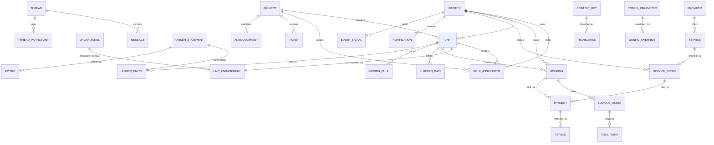

# 02 · Data Model — every entity, every field, in plain language

**What this document is.** The complete data model of myUNO. Builders create the database schema from this document alone; nothing here is optional decoration. The shape follows the constitution's spine — **project → unit → identity → roles** — enforced with real foreign keys, and the three editable layers (content, configuration, design) live in the database like everything else.

Conventions used throughout:
- Every table has `id` (UUID, primary key), `created_at`, `updated_at` (timestamps). These are not repeated in the field lists.
- Money is **THB, stored in satang (integer)** — no floating point. Field names end `_thb` for readability; the unit is satang (1 THB = 100 satang).
- All dates that mean "a calendar night" are `date`; all moments are `timestamptz` in UTC (projects carry a timezone for display).
- `enum` values are lowercase snake_case strings.
- 🔒 marks fields containing personal data with special PDPA handling — encrypted at rest at field level and access-restricted (rules in doc 12).
- "Soft delete" is used only where history matters (`deleted_at` nullable); operational rows are never hard-deleted once money or compliance touched them.

---

## 1. ER overview



The diagram shows the load-bearing relations only; every table below lists its own foreign keys exhaustively.

---

## 2. The spine

### 2.1 `Identity` — a person, global and singular

One row per human, forever, across every role change. This is the "identity graph" of the model.

| Field | Type | Meaning |
|---|---|---|
| `first_name`, `last_name` | text | Name as the person enters it (any script). |
| `latin_first_name`, `latin_last_name` | text, nullable | Latin-script name as in the passport — needed for TM30; asked when first required. 🔒 |
| `email` | citext, unique, nullable | Login + notification address. Nullable because an identity can be created from an OTA booking with phone only. |
| `email_verified_at` | timestamptz, nullable | Set by the verification flow. |
| `phone` | text, unique, nullable | E.164. Primary contact channel for this clientele. 🔒 |
| `phone_verified_at` | timestamptz, nullable | Set by OTP verification (phase: specified, off by default). |
| `hashed_password` | text, nullable | bcrypt. Nullable for OAuth-only or channel-created identities (they set one on claim). Never serialized to the client — the `toSafe` rule from the legacy audit applies. 🔒 |
| `preferred_locale` | enum `ru,en,th` | UI + notification language. Default from config `i18n.default_locale`. |
| `avatar_media_id` | FK→MediaAsset, nullable | Profile photo. |
| `status` | enum `active, invited, blocked, merged` | `invited` = created by staff/channel, not yet claimed. `merged` = duplicate folded into another identity (`merged_into_id` FK→Identity, nullable). |
| `is_admin` | boolean, default false | Platform admin (founder). Kept on the identity, not a role row, so it can never be scoped away accidentally. |
| `notes_internal` | text, nullable | Staff-only notes (visible per doc 03 matrix). |

### 2.2 `AuthAccount` — OAuth linkage

| Field | Type | Meaning |
|---|---|---|
| `identity_id` | FK→Identity | Owner of the account. |
| `provider` | enum `google, apple` | OAuth provider. |
| `provider_account_id` | text | Provider's user id. Unique with `provider`. |

### 2.3 `OneTimeToken` — password reset / email verify / claim links

Hashed single-use tokens (pattern taken from the legacy clone).

| Field | Type | Meaning |
|---|---|---|
| `identity_id` | FK→Identity | Who the token is for. |
| `purpose` | enum `password_reset, email_verify, account_claim` | What it unlocks. |
| `token_hash` | text | SHA-256 of the raw token; raw goes out in the email/message only. |
| `expires_at` | timestamptz | Validity window (config `auth.token_ttl_minutes` per purpose). |
| `consumed_at` | timestamptz, nullable | Single-use enforcement. |

### 2.4 `Project` — a development where inventory concentrates

| Field | Type | Meaning |
|---|---|---|
| `slug` | text, unique | URL identity, e.g. `layan-verde`. |
| `name` | text | Display name (a proper noun — not a content key; project names are the same in all locales). |
| `area_label_key` | content key | Location label ("Layan Beach") — localized. |
| `description_key` | content key | The project story on its landing page. |
| `latitude`, `longitude` | decimal | Map pin. |
| `address` | text | Street address (used on TM30-ready records with unit numbers). |
| `timezone` | text, default `Asia/Bangkok` | Display timezone. |
| `cover_media_id` | FK→MediaAsset, nullable | Hero image. |
| `gallery` | FK list via `ProjectMedia` join table (`project_id`, `media_id`, `sort`) | Landing gallery. |
| `amenity_keys` | text[] | Keys into the amenity catalog (config-owned taxonomy, doc 04 §8). |
| `handbook_key` | content key | The project handbook/rules (persistent reference — replaces the "rules pinned in Telegram"). |
| `status` | enum `draft, live, archived` | Only `live` projects appear publicly. |
| `default_currency` | text, default `THB` | Fixed THB in loop one; field exists so the constraint is visible. |

### 2.5 `Unit` — a home inside a project

| Field | Type | Meaning |
|---|---|---|
| `project_id` | FK→Project | The one project it belongs to. |
| `owner_identity_id` | FK→Identity, nullable | The title-holder **as known to the platform**. Nullable while a unit is being set up before its owner has an identity. |
| `name` | text | Display name/number ("Villa A-3", "B-707"). Unique within project. |
| `unit_type` | enum `villa, condo, townhouse` | Physical type. |
| `bedrooms`, `bathrooms` | int | Capacity description. |
| `max_guests` | int | Hard party-size cap enforced at booking. |
| `size_sqm` | int, nullable | Area. |
| `floor` | text, nullable | For condos. |
| `address_supplement` | text | Unit-level address line for TM30 (building/floor/unit no.). |
| `description_key` | content key, nullable | Listing description (founder-editable, localized). |
| `amenity_keys` | text[] | Unit-level amenities (catalog keys). |
| `base_nightly_thb` | int | Base rate before season/pricing rules. |
| `min_nights` | int, default from config | Minimum stay. |
| `instant_book` | boolean | `false` = request-to-book (host approval flow). |
| `cancellation_policy_key` | text, nullable | Named policy override; null = inherit project/global config. |
| `status` | enum `draft, mobilizing, live, paused, offboarded` | Only `live` is bookable. `paused` hides from search but keeps existing bookings. |
| `permitted_use_confirmed_at` | timestamptz, nullable | **The legal gate.** A unit cannot move to `live` unless set (with the confirming compliance record §11.2). |
| `cover_media_id` + `UnitMedia` join (`unit_id`,`media_id`,`sort`) | | Photo gallery; first is cover. |

### 2.6 `UnitEngagement` — how the unit is on the platform (the economics selector)

Exactly one **active** engagement per unit at a time (enforced by partial unique index on `unit_id` where `status='active'`); history preserved as rows.

| Field | Type | Meaning |
|---|---|---|
| `unit_id` | FK→Unit | The unit. |
| `engagement_type` | enum `direct_managed, via_management_company, owner_direct` | Which economics apply (doc 04 §3, doc 10 §4). |
| `owner_identity_id` | FK→Identity | The owner party to the mandate. |
| `management_org_id` | FK→Organization, nullable | Set when `via_management_company`. |
| `noi_cap_annual_thb` | int, nullable | The negotiated cap for `direct_managed` (`owner = MIN(NOI, cap)`). **No default — set at mobilization** (open question Q14). |
| `fee_override_pct` | decimal, nullable | Per-mandate override of the type's configured fee. Null = use config. |
| `setup_fee_thb` | int, nullable | One-time setup fee if charged. |
| `mandate_media_id` | FK→MediaAsset, nullable | The signed management agreement (document). 🔒 |
| `starts_on`, `ends_on` | date / nullable | Term of the mandate. |
| `status` | enum `draft, active, ended` | Lifecycle. **Gate:** a unit cannot leave `mobilizing` without an `active` engagement (v3 Process A gate: no spend before mandate). |

### 2.7 `Organization` — management company / juristic person

| Field | Type | Meaning |
|---|---|---|
| `name` | text | Legal/trading name. |
| `org_type` | enum `management_company, juristic_person, developer` | What it is in the project's life. |
| `project_id` | FK→Project, nullable | Its home project (a juristic person belongs to one project; an MC may be cross-project → nullable, scoping via RoleAssignment). |
| `contact_email`, `contact_phone` | text | Reachability. |
| `status` | enum `active, suspended` | Kill-switch. |

People act *for* an organization through `RoleAssignment.organization_id` (below) — the org itself never logs in.

### 2.8 `RoleAssignment` — who may do what, where

The permission system's single source (matrix in doc 03). A person holds any number of these.

| Field | Type | Meaning |
|---|---|---|
| `identity_id` | FK→Identity | The person. |
| `role` | enum `owner, guest, resident, buyer, provider_member, mc_member, juristic_member, staff_ops, onsite_host` | The hat. (`admin` is `Identity.is_admin`, not a row — see 2.1.) |
| `scope_type` | enum `platform, project, unit` | Granularity. |
| `project_id` | FK→Project, nullable | Required when scope is `project` or `unit`. |
| `unit_id` | FK→Unit, nullable | Required when scope is `unit`. |
| `organization_id` | FK→Organization, nullable | For `mc_member` / `juristic_member`: which org they act for. |
| `provider_id` | FK→Provider, nullable | For `provider_member`: which provider they act for. |
| `status` | enum `active, revoked` | Revocation preserves history. |
| `granted_by_identity_id` | FK→Identity, nullable | Audit: who granted it (null = system, e.g. booking-created guest role). |

**How the spine plays out:** an owner gets `owner` scoped to each unit they hold; a guest gets `guest` scoped to the unit's project for the life of their booking relationship; staff get `staff_ops`/`onsite_host` per project; MC staff get `mc_member` scoped to the project with `organization_id` set. The portfolio overlay is simply "every role row this identity holds," aggregated.

---

## 3. Stays — booking a home

### 3.1 `Booking`

One row per stay, whatever the channel. This is the calendar of record.

| Field | Type | Meaning |
|---|---|---|
| `unit_id` | FK→Unit | Where. |
| `project_id` | FK→Project | Denormalized for query speed; always the unit's project. |
| `guest_identity_id` | FK→Identity | Who booked (the lead guest). For OTA imports, the identity created/matched at capture. |
| `booking_type` | enum `guest_stay, owner_stay, external_ota, internal_block` | `owner_stay` = the owner in residence (zero-rent, Q7). `external_ota` = imported from a channel. `internal_block` is *not* used — blocks live in `BlockedDate`; the value is reserved to keep importers honest. |
| `channel` | enum `direct, airbnb, booking_com, agoda, agent, manual` | Where demand came from (feeds doc 13). |
| `external_ref` | text, nullable | OTA confirmation code. Unique with `channel`. |
| `status` | enum — see state chart below | Lifecycle. |
| `start_date`, `end_date` | date | Check-in / check-out days (end exclusive for nights math). |
| `adults`, `children` | int | Party size; validated against `max_guests`. |
| `price_breakdown` | jsonb | The server-computed line items frozen at booking: nightly lines (each night + applied rule/season), fees, taxes, discounts. Never trusted from the client. |
| `total_thb` | int | Sum of the breakdown. `0` for `owner_stay`. |
| `balance_due_thb` | int, default 0 | Unpaid difference after an upward modification. |
| `refund_accrued_thb` | int, default 0 | Accrued refunds (downward modification, cancellation) — what has been/should be returned via the provider. |
| `cancellation_policy_snapshot` | jsonb | The exact policy (name + schedule) in force when booked — so later config edits never change an existing booking's terms. |
| `hold_expires_at` | timestamptz, nullable | For `pending_payment`: when the unpaid hold stops blocking dates (config `booking.hold_minutes`). |
| `requested_expires_at` | timestamptz, nullable | For request-to-book: auto-decline deadline (config `booking.request_hours`). |
| `verification_status` | enum `not_required, pending, passports_received, failed` | Pre-arrival guest verification (Q11). |
| `checked_in_at`, `checked_out_at` | timestamptz, nullable | Actual arrival/departure confirmation by staff or self-check-in. |
| `cancelled_at` | timestamptz, nullable + `cancelled_by_identity_id` FK, nullable + `cancellation_reason` text | Cancellation record. |
| `guest_note` | text, nullable | Free-text from guest at booking. |
| `internal_note` | text, nullable | Staff note. |

**Booking status state chart** (transitions only through the booking module — doc 14):

```
requested ──approve──▶ pending_payment ──paid──▶ confirmed ──arrival──▶ checked_in ──departure──▶ checked_out ──inspection──▶ completed
    │                        │                       │                                                     
    ├─decline──▶ declined    ├─hold expiry─▶ expired ├─cancel─▶ cancelled (refund per policy)              
    └─guest cancel─▶ cancelled(free)  └─payment fails─▶ stays pending_payment until expiry                 
external_ota bookings enter directly as confirmed. owner_stay enters as confirmed (no payment).
no_show: set from checked_in step if guest never arrives → status cancelled + reason no_show (refund per policy).
```

Availability rule (shared with search): a unit is unavailable for a range if any `Booking` with status in (`confirmed, checked_in, pending_payment`-with-live-hold, `requested`-if-config-says-requests-block [default: they don't]) or any `BlockedDate` overlaps `start <= reqEnd && end >= reqStart`. (Overlap logic per the legacy clone; holds per `hold_expires_at`.)

### 3.2 `BookingGuest` — the party, for TM30 and records

One row per person in the party (the lead guest included).

| Field | Type | Meaning |
|---|---|---|
| `booking_id` | FK→Booking | The stay. |
| `identity_id` | FK→Identity, nullable | Linked when the party member has an identity (lead guest always). |
| `full_name` | text | As in passport. 🔒 |
| `nationality` | text (ISO alpha-2) | Passport country. 🔒 |
| `passport_number` | text, encrypted | 🔒 Field-level encrypted (doc 12). |
| `date_of_birth` | date, nullable | 🔒 |
| `passport_media_id` | FK→MediaAsset, nullable | Passport photo/scan, stored encrypted, auto-deleted per retention config (doc 12). 🔒 |
| `is_lead` | boolean | The booker. |

### 3.3 `BlockedDate` — host/ops blocks

| Field | Type | Meaning |
|---|---|---|
| `unit_id` | FK→Unit | The unit. |
| `start_date`, `end_date` | date | Range (same shape as bookings so overlap logic is shared). |
| `reason` | enum `maintenance, owner_hold, ota_import, other` | Why. `ota_import` rows come from iCal sync. |
| `note` | text, nullable + `created_by_identity_id` FK | Audit. |
| `external_ref` | text, nullable | iCal UID for sync idempotency. |

### 3.4 `PricingRule` — per-unit seasonal price overrides

The *global* season calendar and markups are configuration (doc 04 §4); this table holds **unit-specific** overrides layered on top.

| Field | Type | Meaning |
|---|---|---|
| `unit_id` | FK→Unit | The unit. |
| `start_date`, `end_date` | date | Range. |
| `nightly_thb` | int | The per-night price for nights in range (beats base + season markup). |
| `label` | text, nullable | Human note ("NYE minimum"). |
| `min_nights_override` | int, nullable | Optional stricter minimum for the range. |

Night pricing resolution order: `PricingRule` (most specific) → base × season markup (config) → base.

### 3.5 `BookingChange` — modification audit

| Field | Type | Meaning |
|---|---|---|
| `booking_id` | FK→Booking | The stay. |
| `change_type` | enum `dates, party, cancel, status, price` | What changed. |
| `old_value`, `new_value` | jsonb | Before/after snapshot. |
| `price_delta_thb` | int, default 0 | + = balance due, − = refund accrued. |
| `actor_identity_id` | FK→Identity | Who did it. |

---

## 4. Services — the marketplace

### 4.1 `Provider` — a vetted supplier

| Field | Type | Meaning |
|---|---|---|
| `name` | text | Trading name. |
| `description` | text, nullable | Shown on the service pages (provider-authored data, not a content key). |
| `contact_email`, `contact_phone` | text | Reachability. |
| `category_keys` | text[] | Service categories they serve (catalog keys, doc 04 §8). |
| `status` | enum `applied, vetting, active, suspended, offboarded` | The badge = `active`. |
| `vetted_at` | timestamptz, nullable + `vetted_by_identity_id` FK, nullable | The trust badge record. |
| `payout_method` | jsonb, nullable | Bank details for remittance. 🔒 |
| `logo_media_id` | FK→MediaAsset, nullable | Branding. |
| `service_area_project_ids` | FK list via `ProviderProject` join, empty = all projects | Where they serve. |

Provider staff log in as identities with `provider_member` role rows pointing at the provider.

### 4.2 `Service` — one orderable thing

| Field | Type | Meaning |
|---|---|---|
| `provider_id` | FK→Provider | Who fulfils. |
| `category_key` | text | Catalog key (transfer, cleaning, chef, tours, …). |
| `title`, `description` | text | Provider-authored, in the provider's languages (localizable via optional `title_ru/en/th` columns — provider data, not platform content keys). |
| `price_model` | enum `fixed, per_hour, per_person, quote` | How it's priced. `quote` = provider quotes in-thread before payment. |
| `base_price_thb` | int, nullable | Null for `quote`. |
| `duration_min` | int, nullable | Typical duration for scheduling. |
| `fulfilment_mode` | enum `referred, operated` | Q3: who bears fulfilment liability. Default `referred`. |
| `advance_notice_hours` | int, default from config | Earliest bookable slot. |
| `available_project_ids` | join `ServiceProject`, empty = provider's areas | Narrower availability. |
| `status` | enum `draft, active, paused` | Visibility. |
| `cover_media_id` + `ServiceMedia` join | | Images. |

### 4.3 `ServiceOrder` — one placed order

| Field | Type | Meaning |
|---|---|---|
| `service_id` | FK→Service + `provider_id` FK denorm | What. |
| `orderer_identity_id` | FK→Identity | Who ordered — **any role** (guest, owner, resident, MC, staff). |
| `orderer_role` | enum (same as RoleAssignment.role) | The hat worn when ordering — orders attach to the identity **and its role** (constitution). |
| `project_id` | FK→Project | Where it happens. |
| `unit_id` | FK→Unit, nullable | The unit it concerns (owner repair, in-stay delivery); nullable for e.g. a transfer. |
| `booking_id` | FK→Booking, nullable | Linked stay when ordered in-stay/pre-arrival. |
| `scheduled_start`, `scheduled_end` | timestamptz | The slot. |
| `quantity` | int, default 1 | Persons/hours per price model. |
| `price_breakdown` | jsonb | Server-computed: base, quantity, take-rate snapshot, any fees. |
| `total_thb` | int | Charged amount. |
| `take_rate_pct_snapshot` | decimal | The commission % in force at order time (doc 04). |
| `status` | enum — chart below | Lifecycle. |
| `cancelled_at`, `cancelled_by_identity_id`, `cancellation_reason` | | Cancellation record. |
| `refund_accrued_thb` | int, default 0 | Refunds per service cancellation policy. |
| `note_to_provider` | text, nullable | Instructions. |
| `address_note` | text, nullable | Where exactly (villa gate code etc. — shown to provider only while order active). |

**ServiceOrder state chart:**

```
placed ──payment──▶ paid ──provider accepts──▶ accepted ──slot happens──▶ fulfilled ──rating──▶ closed
  │                   │                            │
  │                   └─provider declines─▶ declined (auto full refund)
  │                   └─no response by accept SLA─▶ declined (auto full refund)
  ├─payment fails/expires─▶ expired                └─provider no-show─▶ failed (full refund, ticket auto-raised)
  └─orderer cancels (any pre-fulfilment state)─▶ cancelled (refund per service policy)
quote-model orders start at `quote_requested` → provider quotes → `placed` with the quoted price.
```

### 4.4 `Review` — ratings for stays and service orders

| Field | Type | Meaning |
|---|---|---|
| `target_type` | enum `stay, service_order` | What is being reviewed. |
| `target_id` | UUID | The booking or order. Unique with `target_type` + `author_identity_id`. |
| `author_identity_id` | FK→Identity | Reviewer (must be the guest/orderer; eligibility rules in doc 07). |
| `rating` | int 1–5 | Overall. |
| `comment` | text, nullable | Words. |
| `reply` | text, nullable + `replied_at`, `replier_identity_id` | Host/provider public reply. |
| `status` | enum `published, hidden` | Admin moderation switch. |

Provider and unit average ratings are computed, not stored.

---

## 5. Money

Full money semantics are doc 10; these are the records.

### 5.1 `Payment` — one charge attempt through the seam

| Field | Type | Meaning |
|---|---|---|
| `purpose` | enum `stay, stay_balance, service_order, deposit_preauth` | What it pays. |
| `booking_id` / `service_order_id` | FK, one of, nullable | The target. |
| `payer_identity_id` | FK→Identity | Who pays. |
| `method` | enum `cash, card_provider` | **How it was paid.** `cash` = collected in person — the loop-one primary rail for the RU clientele (Q8); `card_provider` = through the payment seam. |
| `provider` | enum `cash, mock, <licensed_provider>` | Adapter used. `cash` for hand-collected money; `mock` until the licensed provider (default **Opn/Omise**) is live (Q8). |
| `provider_session_id` | text, nullable | Checkout session/charge id at the provider. Unique per provider. Null for cash. |
| `amount_thb` | int | Charged amount (or authorized, for pre-auth). |
| `received_by_identity_id` | FK→Identity, nullable | **Cash only** — the staff/host who accepted the money (accountability). |
| `received_at` | timestamptz, nullable | **Cash only** — when it was collected. |
| `receipt_ref` | text, nullable | **Cash only** — the receipt / чек number issued to the guest. |
| `receipt_media_id` | FK→MediaAsset, nullable | **Cash only** — photo/scan of the issued receipt. |
| `status` | enum `created, pending, succeeded, failed, expired, voided` | `voided` = pre-auth released. A recorded cash payment is created directly as `succeeded`. |
| `succeeded_at` | timestamptz, nullable | Settlement moment (= `received_at` for cash). |
| `failure_reason` | text, nullable | Provider's error, for support. |

### 5.2 `Refund` — money going back, by the original method

| Field | Type | Meaning |
|---|---|---|
| `payment_id` | FK→Payment | The original charge. |
| `method` | enum `cash, card_provider` | Refund rail — mirrors the payment's method (a card charge refunds via the provider; a cash payment is refunded in cash and recorded). |
| `amount_thb` | int | Refunded amount (≤ remaining refundable). |
| `reason` | enum `cancellation, modification_decrease, provider_no_show, dispute_resolution, goodwill` | Why. |
| `status` | enum `requested, processing, succeeded, failed` | Provider-side lifecycle; a recorded cash refund is created as `succeeded`. |
| `provider_refund_id` | text, nullable | Provider reference (null for cash). |
| `paid_back_by_identity_id` | FK→Identity, nullable | **Cash only** — the staff/host who handed the money back. |
| `initiated_by_identity_id` | FK→Identity | Who triggered (system for auto-refunds). |

### 5.3 `LedgerEntry` — every baht that touches a unit or the platform

The single source for NOI, statements, and reconciliation. Append-only; corrections are reversal entries, never edits.

| Field | Type | Meaning |
|---|---|---|
| `entry_type` | enum `rental_revenue, service_commission, ota_commission_cost, cleaning_cost, maintenance_cost, consumables_cost, utilities_cost, mc_platform_fee, owner_direct_fee, setup_fee, tax_collected, payout_owner, payout_provider, refund_out, adjustment` | The chart of entry kinds (extensible via migration only — money types are **not** free config). |
| `amount_thb` | int, signed | + = income to the scope, − = cost/outflow. |
| `unit_id` | FK→Unit, nullable | The unit it belongs to (null for platform-level entries). |
| `project_id` | FK→Project, nullable | Denorm/scope. |
| `booking_id` / `service_order_id` / `payment_id` / `refund_id` / `payout_id` | FKs, nullable | Provenance — every automated entry points at its source. |
| `statement_id` | FK→OwnerStatement, nullable | Set when swept into a statement. |
| `occurred_on` | date | Accrual date (which month's statement it lands in). |
| `description` | text | Human line ("Deep clean after B-707 #1234"). |
| `created_by_identity_id` | FK→Identity, nullable | Null = system-generated; set for manually recorded costs. |

### 5.4 `OwnerStatement` — the monthly truth for one unit

| Field | Type | Meaning |
|---|---|---|
| `unit_id` | FK→Unit + `owner_identity_id` FK | Whose, what. |
| `engagement_id` | FK→UnitEngagement | Economics applied. |
| `period_start`, `period_end` | date | The month (config cadence, Q17). |
| `gross_revenue_thb`, `total_costs_thb`, `noi_thb` | int | Computed from ledger entries in period. |
| `owner_share_thb`, `estate_share_thb` | int | `owner = MIN(NOI, cap_pro_rata)`; `estate = MAX(0, NOI − cap_pro_rata)` for direct-managed; other engagement types per doc 10 §4. |
| `cap_applied` | boolean | Whether the cap bit. |
| `status` | enum `draft, published, superseded` | Admin reviews `draft` → `published` (the sign-off gate); corrections create a new statement and mark the old `superseded`. |
| `published_at` | timestamptz, nullable + `published_by_identity_id` | The sign-off record. |
| `pdf_media_id` | FK→MediaAsset, nullable | The rendered statement document. |

### 5.5 `Payout` — money actually sent

| Field | Type | Meaning |
|---|---|---|
| `payee_type` | enum `owner, provider` | Who is paid. |
| `owner_statement_id` | FK, nullable | For owner payouts: the statement settled. |
| `provider_id` | FK→Provider, nullable + `period_start/end` | For provider remittances: the period covered. |
| `amount_thb` | int | Sent amount. |
| `method` | enum `bank_transfer_thb, other` | Rails (Q18: manual in loop one). |
| `reference` | text | Bank reference. |
| `executed_on` | date + `recorded_by_identity_id` FK | Who recorded the execution. |
| `status` | enum `recorded, reconciled` | Reconciliation tick (doc 10 §8). |

---

## 6. Compliance

### 6.1 `Tm30Filing` — one filing obligation per foreign party member

Created automatically at check-in confirmation for every `BookingGuest` (Thai nationals: created as `not_required`).

| Field | Type | Meaning |
|---|---|---|
| `booking_id` + `booking_guest_id` | FKs | Who/which stay. |
| `due_at` | timestamptz | Check-in + 24h — **the legal SLA**. |
| `status` | enum `pending, filed, failed, escalated, not_required` | `failed` = attempted, portal refused (unhappy path Q10); `escalated` = SLA at risk, admin alerted. |
| `filed_at` | timestamptz, nullable + `filed_by_identity_id` | The filing record. |
| `receipt_media_id` | FK→MediaAsset, nullable | The filing receipt/screenshot. |
| `failure_note` | text, nullable | What went wrong, for the escalation. |

### 6.2 `ComplianceRecord` — per-unit legal status items

| Field | Type | Meaning |
|---|---|---|
| `unit_id` | FK→Unit (or `project_id` for project-level items; exactly one set) | Scope. |
| `record_type` | enum `permitted_use, insurance, license, title_audit, other` | What it certifies. |
| `status` | enum `pending, confirmed, expired, failed` | `confirmed` on `permitted_use` is what unlocks `Unit.permitted_use_confirmed_at`. |
| `verified_at`, `verified_by_identity_id` | | Who confirmed. |
| `expires_on` | date, nullable | Renewal tracking (insurance, licenses). |
| `document_media_id` | FK→MediaAsset, nullable | Evidence. 🔒 |
| `note` | text, nullable | Details. |

### 6.3 `ConditionReport` — the neutral record that settles disputes

| Field | Type | Meaning |
|---|---|---|
| `unit_id` | FK→Unit + `booking_id` FK, nullable | Scope (baseline reports have no booking). |
| `report_type` | enum `baseline, check_in, check_out, incident` | When taken. |
| `photos` | join `ConditionReportMedia` (`report_id`,`media_id`,`sort`,`caption`) | The evidence. |
| `notes` | text | Findings ("scratch on dining table — pre-existing"). |
| `created_by_identity_id` | FK→Identity | Staff member. |

### 6.4 `MobilizationChecklistItem` — Process A as a checklist on the unit

| Field | Type | Meaning |
|---|---|---|
| `unit_id` | FK→Unit | The unit being mobilized. |
| `step_key` | enum `qualify, mandate, legal_audit, condition_survey, standards_uplift, pricing_setup, golive_checklist` | v3 Process A steps 1–7. |
| `status` | enum `pending, done, blocked, skipped` | Progress. Gates: `mandate` done requires active engagement; `legal_audit` done requires `permitted_use` ComplianceRecord confirmed; `golive_checklist` done flips unit to `live`. |
| `completed_at`, `completed_by_identity_id`, `note` | | Audit. |

---

## 7. Communication (shapes; behavior in doc 09)

### 7.1 `Thread` / `ThreadParticipant` / `Message`

| `Thread` field | Type | Meaning |
|---|---|---|
| `context_type` | enum `booking, service_order, ticket, unit, general` | What it's about (renders the header context). |
| `context_id` | UUID, nullable | The related row. |
| `project_id` | FK→Project, nullable | Scope for staff visibility. |
| `last_message_at` | timestamptz | Inbox ordering. |

| `ThreadParticipant` field | Type | Meaning |
|---|---|---|
| `thread_id` + `identity_id` | FKs, unique together | Membership — **participants only** may read/write (enforced in every query). |
| `participant_role` | role enum | The hat in this thread (owner↔MC, guest↔host…). |
| `last_read_at` | timestamptz, nullable | Read receipts + unread badges. |
| `muted` | boolean, default false | Per-thread notification mute. |

| `Message` field | Type | Meaning |
|---|---|---|
| `thread_id` + `sender_identity_id` | FKs | Who said. |
| `body` | text, nullable | Words (nullable for photo-only). |
| `attachments` | join `MessageMedia` | Photos/files. |
| `message_kind` | enum `user, system` | `system` = automated in-thread events ("Booking #1234 confirmed") so context stays in one stream. |

### 7.2 `Ticket` / `TicketEvent`

| `Ticket` field | Type | Meaning |
|---|---|---|
| `project_id` | FK→Project + `unit_id` FK, nullable | Where. |
| `raised_by_identity_id` + `raised_by_role` | FK + role enum | Who, wearing which hat (owner, guest, resident, MC…). |
| `assignee_identity_id` | FK→Identity, nullable | The staff member responsible (assignment rules doc 09 §3). |
| `category_key` | text | Catalog key (maintenance, housekeeping, complaint, billing_question, other — doc 04 §8). |
| `title` + `description` | text | The ask. |
| `photos` | join `TicketMedia` | Evidence. |
| `priority` | enum `low, normal, high, urgent` | Triage. |
| `status` | enum `open, acknowledged, in_progress, waiting_reporter, resolved, closed, cancelled` | The light tracker's chart (doc 09 §3). |
| `sla_due_at` | timestamptz, nullable | From config per category/priority (doc 04 §6). |
| `resolved_at` + `resolution_note` | | Outcome, visible to the reporter — **transparency for remote owners**. |
| `thread_id` | FK→Thread, nullable | The conversation attached to the ticket. |

`TicketEvent`: `ticket_id`, `event_type` enum (`status_change, assignment, comment_added, sla_escalation`), `actor_identity_id` nullable, `data` jsonb — the full visible history.

### 7.3 `Announcement` / `AnnouncementRead`

| `Announcement` field | Type | Meaning |
|---|---|---|
| `project_id` | FK→Project | The channel — announcements are always project-scoped. |
| `author_identity_id` | FK→Identity | Poster. |
| `posted_as` | enum `myuno, juristic_person, management_company` | The official voice (constitution: juristic persons post too). `organization_id` FK, nullable, set for the latter two. |
| `title` + `body` | text | The notice (author-written data, not content keys). |
| `audience` | enum `everyone, owners, residents, guests_in_stay, staff` | Who sees it (evaluated against role rows). |
| `pinned` | boolean + `valid_until` timestamptz, nullable | Display control. |
| `published_at` | timestamptz, nullable | Draft until set. |

`AnnouncementRead`: `announcement_id` + `identity_id` + `read_at` — read tracking (condo's proven pattern).

### 7.4 `Notification` / `NotificationDelivery`

| `Notification` field | Type | Meaning |
|---|---|---|
| `identity_id` | FK→Identity | Recipient. |
| `type_key` | text | Typed catalog key (doc 11 catalog). |
| `content_key` | text + `params` jsonb | The localized template + its variables — rendered in the recipient's locale at display/send time. |
| `link_path` | text, nullable | In-app deep link. |
| `read_at` | timestamptz, nullable | Bell state. |

`NotificationDelivery`: `notification_id`, `channel` enum (`in_app, email, whatsapp, telegram`), `status` enum (`queued, sent, failed, skipped_disabled`), `provider_ref` text nullable, `sent_at` — one row per attempted channel (doc 11 routing).

---

## 8. Content & configuration (the editable layers)

### 8.1 `ContentKey` / `Translation`

| `ContentKey` field | Type | Meaning |
|---|---|---|
| `key` | text, unique | Dot-path, e.g. `booking.widget.cta` (namespaces doc 05 §4). |
| `namespace` | text | First segment, indexed for the editor's tree. |
| `description` | text | What/where this string is — written for the founder editing it. |
| `supports_rich` | boolean, default false | Whether the value may contain simple markup (handbook pages, email bodies). |

| `Translation` field | Type | Meaning |
|---|---|---|
| `content_key_id` + `locale` | FK + enum `ru,en,th`, unique together | One value per language. |
| `value` | text | The string (ICU-style `{placeholders}` allowed, doc 05 §3). |
| `status` | enum `ok, needs_review, missing` | Editorial workflow (Q19). |
| `updated_by_identity_id` | FK | Who last edited. |

### 8.2 `ConfigParameter` / `ConfigOverride` / `ConfigChange`

| `ConfigParameter` field | Type | Meaning |
|---|---|---|
| `key` | text, unique | Dot-path, e.g. `services.take_rate_pct` (full registry doc 04). |
| `value_type` | enum `int, decimal, percent, boolean, string, enum, json, money_thb, schedule` | Editor renders the right control. |
| `default_value` | jsonb | The global default. |
| `enum_options` / `json_schema` | jsonb, nullable | Validation for `enum`/`json` types. |
| `scopeable_to` | enum `global_only, project, unit` | Deepest override level allowed. |
| `group_key` | text + `description` text | Admin-panel grouping + founder-readable explanation. |

`ConfigOverride`: `parameter_key` FK, `scope_type` enum (`project, unit`), `scope_id` UUID, `value` jsonb, `updated_by_identity_id` — resolution: unit → project → default.
`ConfigChange`: append-only log — `parameter_key`, `scope_type/scope_id` nullable, `old_value`, `new_value`, `changed_by_identity_id`. Every change is visible history.

---

## 9. Analytics & signals

### 9.1 `AnalyticsEvent`

Append-only event stream (catalog in doc 13).

| Field | Type | Meaning |
|---|---|---|
| `event_key` | text | From the doc-13 catalog (`stay.booked`, `service.ordered`, `page.project_viewed`, …). |
| `identity_id` | FK, nullable + `anonymous_id` text, nullable | Who (either). |
| `project_id` / `unit_id` / `booking_id` / `service_order_id` | FKs, nullable | Dimensions. |
| `payload` | jsonb | Event-specific fields per catalog. |
| `occurred_at` | timestamptz | Event time. |

### 9.2 `BuyerSignal` — the loop's most valuable row

| Field | Type | Meaning |
|---|---|---|
| `identity_id` | FK→Identity | The guest showing buyer behavior. |
| `signal_key` | enum `repeat_stay, long_stay, purchase_question, listing_engagement, direct_inquiry` | Detector (rules doc 13 §4). |
| `strength` | int 1–3 | Weak/medium/strong per detector rules. |
| `source_ref` | jsonb | Evidence pointer (booking ids, message id, event ids). |
| `status` | enum `new, reviewed, handed_to_capital, dismissed` | The human funnel (Q1: transaction itself is off-platform). |
| `reviewed_by_identity_id`, `note` | | Follow-up record. |

---

## 10. Shared infrastructure

### 10.1 `MediaAsset`

| Field | Type | Meaning |
|---|---|---|
| `storage_key` | text | Object path in the bucket (upload seam, doc 14 §7). |
| `kind` | enum `photo, document, receipt, passport, avatar, brand` | Handling class — `passport` implies encryption + retention rules (doc 12). |
| `mime_type` + `size_bytes` | | File facts. |
| `uploaded_by_identity_id` | FK | Provenance. |
| `encrypted` | boolean | Whether stored under envelope encryption. |
| `delete_after` | date, nullable | Retention deadline (set for 🔒 kinds per config). |

### 10.2 `AuditLog`

Every privileged mutation (admin config/content edits, role grants, statement publishing, manual ledger entries, PII access per doc 12) writes: `actor_identity_id`, `action` text, `entity_type` + `entity_id`, `data` jsonb, `at`. Append-only.

### 10.3 `IntegrationAccount` (the channel seam's registry)

| Field | Type | Meaning |
|---|---|---|
| `integration_key` | enum `ical_airbnb, ical_booking, payment_provider, whatsapp, telegram, crm_hubspot` | Which channel. |
| `scope_type/scope_id` | platform / project / unit | Where it applies (an iCal URL is per unit). |
| `config` | jsonb | Keys/URLs/tokens — secret fields envelope-encrypted. 🔒 |
| `status` | enum `active, error, disabled` + `last_sync_at`, `last_error` | Health surfaced in admin. |

---

## 11. What deliberately does NOT exist in loop one

To keep scope honest: no wishlist/saved-search, no community feed/marketplace tables (the home-space social layer is phase 2 per v3 §30.4 — the `Thread`/`Announcement` shapes are its foundation), no meter readings, no multi-currency amounts (THB only), no channel-manager entities beyond `IntegrationAccount` + iCal blocks, no service-desk escalation matrices beyond `sla_due_at` + escalation events, no buyer-transaction records (Capital-led, Q1). Each returns as a module addition without touching the spine.

*Every enum, gate, and rule above is referenced by the flows (doc 07), permissions (doc 03), money (doc 10), and build plan (doc 16). If a builder finds a field a flow needs that is not here, that is a spec bug: log it in `open_questions.md` — do not invent silently.*
