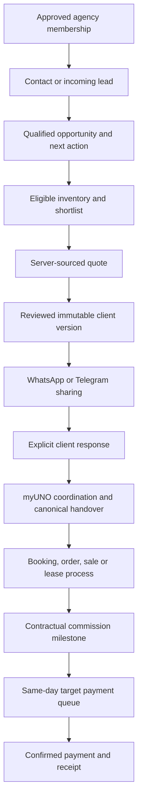

# AGENT_MODULE.md — myUNO Agent HomeSpace and Commercial Partnership

> **Status:** detailed implementation specification; proposed functionality, not a statement of deployed capability.  
> **Date:** 2026-10-02, Asia/Bangkok.  
> **Target repository:** pavel949/myUNO-final.  
> **Inspected main baseline:** f5e16d8198aba416a6cf75897013ab25c996e3d6.  
> **Authority:** subordinate to PROJECT.md and docs/canonical/.  
> **Audience:** product, engineering, commercial operations, partner success and finance.

## 1. Purpose and partnership model

The Agent module gives commercial agents and agencies a professional HomeSpace inside myUNO. It combines a private CRM, distributable inventory, supported quotations, client communications, knowledge, MyUNO assistance and transparent commission progress.

The operating relationship is:

- **Agent:** introduces and qualifies the client, understands requirements, recommends options, communicates with the client and maintains the commercial relationship.
- **myUNO:** supplies eligible inventory, supports quotations, handles the agreed administrative, contractual and non-client-facing transaction work, coordinates fulfillment and pays commissions when due.
- **Client:** receives understandable options, supported prices and conditions, a clear contact and an accountable next step.

The module must make agents feel protected through explicit rights, preserved attribution, appropriate privacy and visible payment evidence.

### 1.1 Core promises

1. Easy access to real, eligible rental and sale inventory.
2. Fast preparation and distribution of offers from supported data.
3. A useful private contact book and pipeline.
4. Reliable knowledge and contextual assistance.
5. Clear division of responsibility with myUNO.
6. Confirmed referral attribution and a documented dispute process.
7. Same-day payment as the operational target; commissions paid within a maximum of three days after becoming due.

### 1.2 Confirmed instructions and remaining policy choices

| Topic | Requirement or status |
|---|---|
| Rental and sale inventory | Required; use canonical myUNO inventory and commercial eligibility |
| Agent quotations and client information | Required; agents can prepare and share from the system |
| Normal communication | WhatsApp and Telegram are primary channels |
| Administrative and contractual work | myUNO handles the agreed non-client-facing process |
| Commission payment | Target same day; maximum three days once due |
| Private agent CRM | Required for contacts, leads, opportunities and follow-up |
| Shared CRM architecture | One engine with scoped Agent, Team and Admin workspaces |
| Commission rates and calculation bases | Must come from approved agreement versions; not specified here |
| Event that makes commission due | Must be specified separately for rentals, sales and other enabled types |
| Calendar versus business days | Recommend calendar days; contract definition must be approved before payout activation |
| Introduction protection period and scope | Must be defined in the partnership agreement |
| Repeat stays, renewals and cross-sell attribution | Must be defined; no automatic lifetime entitlement |
| Client-contact boundaries | Document the agreed coordination and permitted direct contact |

Technical workflows can be built without inventing these commercial terms. Missing terms must disable the affected monetary promise or commitment, while permitted contact management and draft preparation remain available.

## 2. Canonical architecture and current-state reconciliation

myUNO already connects identity, assets, commercial relationships, bookings, services, ownership and finance. The Agent module is a scoped experience and orchestration layer over those foundations.

### 2.1 Existing foundations

| Existing element | Reuse |
|---|---|
| Identity | One canonical person across guest, buyer, owner and commercial relationships |
| Organization and RoleAssignment | Extend for approved agency membership and organization-scoped capabilities |
| CrmProfile | Preserve existing internal relationship behavior; do not treat global fields as an agency's private profile |
| CrmOpportunity / CrmActivity | Commercial needs, stages, activities and next actions |
| CrmConsent / CrmAttributionTouch | Extend or reference for contextual purpose and request-level attribution |
| Project / Unit / InventoryCategory | Canonical physical property and capacity |
| CommercialOffering | Supported sale, long-term rental and stay commercial modes |
| Canonical price and availability services | Authoritative quote calculations and availability validation |
| Booking | Stay transaction and normal confirmation/payment lifecycle |
| PropertyDeal | Existing sale/long-term rental agreement process |
| ServiceQuoteRequest / ServiceQuoteVersion / ServiceOrder | Service quotation and fulfillment handover |
| ContentKey / Translation / FAQ / Help Center | Existing localization and reviewed knowledge inputs |
| Audit / communications / finance | Traceability, delivery and financial facts |

### 2.2 Proven gaps at the inspected baseline

- RoleType has no dedicated agent role.
- RoleScopeType has platform/project/unit, but no complete organization scope.
- OrganizationType does not represent a brokerage/agency.
- RoleAssignment has organizationId, but that field alone does not provide agency authorization.
- CrmProfile is unique per Identity and contains global relationship fields.
- CrmOpportunity has no explicit CRM workspace ownership or collaboration access.
- Inspected CRM API routes use requireAdmin.
- Public enquiry intake creates an admin-oriented thread; it is not private agency intake.
- No dedicated governed knowledge/version, agency proposal/version or contractual agent commission model was found in the inspected schema.
- BookingChannel.agent and referrer/source fields are attribution foundations, not proof of access or commission entitlement.

### 2.3 Non-negotiable integration rules

1. Do not create a second global person, property, booking, order or ledger universe.
2. Keep one physical Unit across alternative commercial modes.
3. A published proposal is not a capacity hold or confirmed transaction.
4. A CRM stage cannot establish legal ownership or active operating authority.
5. Client totals are never authoritative.
6. Never confirm from a stale or unauthorized source projection.
7. Accepted historical commercial terms remain unchanged after later configuration.
8. Scope all reads, writes, search, exports, media, aggregates and AI context.
9. Do not grant admin, staff_ops or mc_member merely to enable agent CRM access.
10. No ordinary agency needs a new application, database or auth system.
11. No n8n dependency is required by this module.
12. Code existence and a green build are not production readiness.

## 3. Users and workspaces

### 3.1 Workspace types

| Workspace | Primary outcome | Default visibility |
|---|---|---|
| Agent / Agency | Private relationship management and selling through myUNO | Assigned agency relationships and explicitly shared opportunities |
| myUNO Team | Direct demand, partner assistance, commercial execution and handover | Assigned internal work and permitted partner collaborations |
| Admin oversight | Governance, routing, exceptions, partner review and permission administration | Authorized oversight with audited privileged actions |
| Client projection | Understand and respond to an issued offer | Explicitly shared client-safe material only |

Workspace switching changes context, not permission.

### 3.2 Roles and capabilities

Proposed capabilities must be reconciled with current membership/permissions implementation before schema changes.

| Actor | Allowed responsibilities |
|---|---|
| Agent member | Assigned contacts/leads/opportunities, drafts, sharing, assistance and permitted commission view |
| Agency manager | Approved team scope, assignment and constrained agency invitations |
| myUNO CRM member | Assigned internal opportunities and accepted collaboration tasks |
| myUNO CRM manager | Routing, queues, team assignment and commercial exceptions within permitted scope |
| Knowledge editor | Draft/review/publish in assigned topic and audience scope |
| Finance | Approved entitlements, due milestones, obligations, payment and reconciliation |
| Platform admin | Approved governance and audited exceptional access |
| Client | Read and respond to selected proposal version and authorized transaction actions |

Permission is resolved from active Identity, active membership, scoped role, resource relationship, action/field restrictions and resource state.

## 4. Entry points and route structure

### 4.1 Entry points

| Surface | Entry | Outcome |
|---|---|---|
| Public partner navigation | Agents & Agencies | Understand partnership; apply or sign in |
| Footer | Agent Portal | Direct sign-in/workspace route |
| Personal account | My Agent Workspace | Approved memberships only |
| Invitation | Accept agency invitation | Existing account reuse or registration, membership acceptance |
| Inventory | Add to client shortlist / Prepare offer | Select an authorized opportunity or start a request |
| Knowledge | Use in client response | Draft attached to permitted CRM context |
| Notifications | Client response / myUNO reply / payment update | Open exact record and next action |
| Team navigation | CRM | Internal commercial workspace |
| Admin navigation | CRM oversight / Agent partners | Govern rather than expose the agent's daily UI |

Application submission does not activate agency status, commission rights or inventory-operating authority.

### 4.2 Proposed routes

These routes are implementation targets, not existing capability claims.

```text
/partners/agents
/partners/agents/apply

/agent
/agent/crm/contacts
/agent/crm/contacts/[relationshipId]
/agent/crm/leads
/agent/crm/opportunities
/agent/crm/opportunities/[opportunityId]
/agent/crm/activities
/agent/inventory
/agent/offers
/agent/offers/[proposalId]
/agent/knowledge
/agent/knowledge/[slug]
/agent/commissions
/agent/team
/agent/settings

/work/crm
/work/crm/inbox
/work/crm/opportunities/[opportunityId]

/app/admin/agent-partners
/app/admin/agent-knowledge

/p/[token]
```

Preserve existing /app/admin/crm routes during transition. Check route groups and middleware before implementation.

Use the existing adaptive landing/surface switcher. Preserve active-stay priority; an agent on holiday can still switch to Agent HomeSpace.

## 5. HomeSpace information architecture

Primary navigation:

**Today · Contacts & CRM · Inventory · Offers & Quotes · Knowledge · Commissions**

Team and settings belong in the account/workspace menu.

### 5.1 Today

Default primary action: **New client request**.

Prioritize:
1. Overdue and today's actions.
2. New leads awaiting first response.
3. Client replies and selections.
4. Quotes ready to share or requiring update.
5. myUNO requests awaiting information.
6. Pending handovers and operational exceptions.
7. Due commissions and completed payments.
8. Relevant changes to saved inventory or knowledge.

Each row contains context, state, due time, owner, blocker and next action.

Metrics must drill into permitted source rows. Never mix gross property value, company revenue and agent earnings.

### 5.2 Responsive behavior

- Desktop: compact navigation, central task, optional contextual assistant.
- Mobile: Today, CRM, Offers and Knowledge as primary navigation; inventory accessible during selection and from the workspace; commissions/settings in additional navigation.
- Use existing Andaman, ivory and restrained gold tokens.
- Use familiar list, record-header, status, source-chip, inbox and sticky-action components.
- At most one dominant primary action per screen.
- Require loading, empty, error, forbidden, stale, partial-data and recoverable conflict states.
- Server acknowledgment distinguishes saved/published/sent/paid from pending intent.
- RU-first UI; critical flows also reviewed in EN and TH.
- Proposal/client-message language is independently selectable.

## 6. CRM concepts and privacy

### 6.1 Contacts, leads, opportunities and transactions

| Concept | Definition |
|---|---|
| Contact | A workspace relationship with a person or organization |
| Lead | An incoming or newly identified expression of interest |
| Opportunity | A specific commercial need being pursued |
| Proposal | Versioned client material recommending options and conditions |
| Collaboration | Explicit participation by myUNO or another authorized party |
| Transaction | Canonical Booking, PropertyDeal, ServiceOrder or another supported domain result |

Saving a contact must not create a fictitious opportunity. One contact may have multiple real opportunities.

### 6.2 Workspace contact relationship

Maintain one canonical Identity and a separate scoped relationship for each permitted workspace.

Relationship fields include:
- workspace and stable relationship ID;
- canonical Identity reference;
- assigned agent;
- local display name/alias where appropriate;
- tags, local relationship status and preferences;
- source/introduction;
- last interaction and next action;
- permitted contact points and contact basis;
- private notes and permitted documents;
- linked opportunities.

Agency updates must not silently overwrite shared Identity fields or another organization's CRM lifecycle, tags, account owner or consent.

Contact entry does not require client login and does not automatically send an invitation.

Exact contact matching happens privately. The agency must not learn that another agency or myUNO already has that person. Ambiguous identity resolution is reviewed; no fuzzy automatic merge.

A contact relationship may be archived without deleting canonical transactions, financial history or another workspace's relationship.

### 6.3 Contact import and export

Provide CSV preview, field mapping, validation, workspace-local duplicate handling, result report and idempotent retry.

Imported records stay in the agency scope. Import must not create platform-wide marketing permission or send invitations/messages.

Export only permitted relationship fields; audit the export. A client data request is handled through the appropriate privacy process, not by deleting Identity indiscriminately.

## 7. Leads and pipeline

### 7.1 Lead intake

Sources:
- manual entry after a client conversation;
- permitted CSV import;
- agency-specific enquiry form;
- configured WhatsApp/Telegram adapter;
- myUNO referral or explicit delegation;
- client response to an attributed offer.

Capture source, receivedAt, external submission/message ID where available, workspace, routing state, contact basis and requirement context.

Current public intake is admin-oriented. Agency-private intake must use a scoped command rather than notifying all admins about every contact.

Reconcile the existing enquiry/thread flow before adding persistent intake models. Do not create duplicate opportunities for replayed events.

### 7.2 Inbox behavior

Lead states: new, needs_response, qualifying, awaiting_information, converted, dismissed.

Conversion links to one canonical opportunity, preserving intake evidence. Existing implementations that use a new-stage opportunity for intake must be reconciled so the inbox is a view of the same demand, not a competing pipeline.

No available assignee means a visible unassigned queue with a fallback owner, not loss of the lead.

### 7.3 Opportunity directions

Support stay, long-term rental, purchase, sale, management and real service/complex requests.

Reconcile with the current CrmOpportunityType enum. Do not encode a new service direction as an unrelated existing type merely to avoid a migration.

### 7.4 Stages

Preserve shared meanings:

`new → qualified → discovery → proposal → negotiation → won / lost`

Nurture is an explicit holding/follow-up state with an owner and next action.

Stage transitions validate prerequisites on the server. A card drag is an interaction, not permission.

Won must follow the applicable commercial outcome evidence. It cannot create title, receipt, fulfillment or commission simply by changing the stage.

### 7.5 Opportunity ownership and responsibility

Store separate concepts:
- home workspace;
- assigned agency agent;
- myUNO coordinator;
- collaboration participants and permitted fields/actions;
- source/referral attribution;
- next-action owner;
- task assignee.

CreatedBy is not equivalent to assignedTo. Agent referral attribution is not equivalent to current task ownership.

### 7.6 Opportunity screen

Header: client, direction, stage, urgency, agent, myUNO coordinator, next action.

Tabs:
1. Overview — brief, requirements, unknowns and blockers.
2. Shortlist — selections, comparison and recommendations.
3. Offers & Quotes — drafts, versions, validity and responses.
4. Activity — permitted timeline, tasks, calls and meetings.
5. myUNO Collaboration — shared brief, requests and handover.
6. Documents — explicit private/shared classification.
7. Outcome — linked transaction and commission progression where permitted.

Primary actions: Prepare offer, Share, Ask myUNO.

Completing an activity allows recording the outcome and scheduling the next action together.

## 8. Cooperation with myUNO

### 8.1 Responsibility map

| Agent | myUNO |
|---|---|
| Client needs and qualification | Eligible inventory and supported conditions |
| Recommendations and client communication | Quote assistance and authorized commercial approval |
| Offer presentation | Administrative and contractual preparation |
| Relationship follow-up | Payment coordination and transaction milestones |
| Client decision support | Operational handover and agreed fulfillment coordination |
| Timely information from the client | Commission confirmation and payment |

Specify responsible parties per transaction; do not advertise a blanket guarantee for functions outside myUNO's authority.

### 8.2 Work with myUNO

1. Select opportunity and assistance type.
2. Review the brief and selected fields/documents to share.
3. Confirm the applicable basis for sharing.
4. Submit to the appropriate internal queue.
5. Assign a coordinator and acknowledge.
6. Exchange scoped requests/comments.
7. Accept a canonical handover or return a clarification/blocker.
8. Preserve the agent's agreed attribution.

Keep one opportunity with explicit access grants. Do not copy it into a second CRM.

Agency-private notes and myUNO-private notes remain distinct. New comments require an obvious visibility choice, with conservative defaults.

### 8.3 Collaboration state

`requested → accepted → awaiting_information / in_progress → completed / declined`

Collaboration state is separate from opportunity stage and transaction status.

Grant access to the required opportunity context; never grant myUNO staff blanket access to an agency's entire contact book through one collaboration.

### 8.4 Assistance actions

- Check availability.
- Confirm terms.
- Request a formal quote.
- Arrange viewing.
- Source alternatives.
- Prepare contract.
- Request payment instructions.
- Review management request.
- Resolve an issue.

Carry known context automatically. Show owner, current state, missing information, deadline if actually agreed and next step.

No response-time promise is displayed without an approved operational SLA.

## 9. Inventory and agent distribution

### 9.1 Catalogue source

Use Project, Unit, InventoryCategory and active eligible CommercialOffering. Apply the same physical, commercial, evidence and authority rules as the owning domains.

Rental modes and sales are independent rights. Sale-only supply must not become short-stay bookable. Alternative bedroom configurations share physical capacity.

Source-owned/federated inventory, including Layantara, must follow its explicit quote/booking authority and freshness rules.

### 9.2 Search

Start from a client brief or standalone inventory search.

Filters adapt to direction: area, project, dates, guests, bedrooms, budget, duration and supported amenities.

Unknown facts are not treated as matches. Explain recommendations using the client's actual requirements.

A private/unpublished listing can be distributed only through explicit distribution rights; agency membership alone does not authorize publication.

### 9.3 Agent Pack

Each eligible listing offers:
- approved images and image-context labels;
- approved descriptions and relevant facts;
- applicable commercial mode and responsible party;
- current supported price/quote-required state;
- known inclusions, exclusions and policies;
- approved FAQ;
- concise WhatsApp/Telegram message;
- client property sheet;
- attributed, revocable client link.

Actions: Share property, Add to shortlist, Generate quote, Request clarification.

Image rights, approved visibility and actual-unit versus representative category labels apply in exports and messages as well as catalogue pages.

### 9.4 Collections and distribution

Agents can maintain client-specific shortlists and approved shareable collections.

Include agent/agency identity and contact details where authorized, with truthful myUNO/operator responsibility. Co-branding must not obscure the responsible contracting or operating party.

Attribution links record source evidence. A click does not establish sole ownership of a person or automatic fee entitlement.

Do not automatically message imported contacts or broadcast new inventory. Distribution requires deliberate action and the applicable channel/contact basis.

### 9.5 Changed or unavailable inventory

Issued versions preserve historical facts. Current sharing/commitment checks re-evaluate eligibility and quote validity.

Show what changed, offer re-quotation or alternatives, and retain the client's requirement.

A valid quote does not guarantee unheld availability. No match leads to a tracked sourcing request rather than invented supply.

## 10. Fee quotes, offers and proposals

### 10.1 Separate documents

| Document | Audience | Content |
|---|---|---|
| Client quote/proposal | Client | Property/service, supported price, applicable fees, deposit, inclusions, payment/cancellation conditions |
| Agent remuneration statement | Agent/authorized agency | Accepted agreement version, basis, expected/confirmed fee and payable milestone |
| Internal approval record | Authorized myUNO team | Pricing exception, approval and evidence |

Agent commissions and internal margin must not enter client material automatically.

Any additional agent-charged client fee requires an explicitly approved arrangement and appropriate disclosure.

### 10.2 Quote workflow

`client → direction → inventory/components → server quote → review → publish → share → response → canonical handover`

Use progressive input and server autosave. Client details and requirements are not re-entered.

Agents may edit narrative and recommendation. Approved monetary fields, tax/fee basis and compulsory terms are not freely overwritten.

Request discounts or exceptions through the party holding actual authority.

### 10.3 Rental quote

Include applicable:
- unit/category and responsible party;
- exact dates and party requirements;
- rent/stay total and currency;
- duration/period;
- services and other charges;
- deposit and payment schedule;
- included/excluded items and utilities;
- cancellation/change conditions;
- quote validity and separate availability status.

Use canonical server pricing, including source tariff gates. Preserve integer minor units.

### 10.4 Sale quote

Include:
- eligible property and supported commercial offering;
- supported asking/approved offer price;
- currency and applicable disclosed charges;
- inclusions and limitations;
- next steps, viewing and evidence-review process;
- conditions requiring confirmation;
- validity and authority.

Do not assert legal title suitability, foreign quota, guaranteed yield or transfer completion without approved evidence. The public Project Passport is not a substitute for professional due diligence.

### 10.5 Publication types and totals

- **Discussion shortlist:** may contain options with clearly unknown/unpriced terms.
- **Priced proposal:** requires supported commercial figures and conditions.

Use explicit unknown states; zero is not unknown.

Different currencies, periods and unpriced components cannot create a fictitious total. Packages retain component-specific responsibility, acceptance, cancellation and money.

### 10.6 Versions and client access

Drafts use optimistic concurrency. Published versions are immutable; changes create a new version.

Each published version freezes relevant facts, source references, language, amounts/basis, conditions, validity, author and publication time.

Client share grants use cryptographically random tokens, stored hashed, with expiry/revocation and explicit read/response permissions.

Use noindex, restrictive referrer/cache handling and client DTO allowlists. A share link does not grant access to private underlying property records.

PDF uses the same approved client projection. It includes issue date, version and validity. A downloaded PDF cannot be revoked after download.

### 10.7 Client response

Record exact version, selected component and explicit response.

Reading a page, link preview or bot fetch is not acceptance. Anonymous selection is a preference/intention until the appropriate identity/terms requirements are met.

Selected stay → canonical re-quote/hold/Booking.  
Selected service → applicable QuoteVersion/Order.  
Selected sale/lease → PropertyDeal.  
Selected management → qualification/mandate/onboarding.

A response does not itself create confirmed capacity, payment, legal title, active authority or commission.

## 11. WhatsApp and Telegram communication

### 11.1 Primary communication modes

| Mode | Behavior | Evidence |
|---|---|---|
| Agent-account sharing | Generate text + link; open supported channel compose/share flow | Prepared; agent can explicitly record manual transmission |
| Connected business/bot delivery | Send through configured authorized adapter | Actual provider-supported delivery acknowledgment |
| In-system collaboration | Exchange scoped information with myUNO | Durable authorized message/activity event |

Start with agent-account sharing so agents can use their established client conversations.

WhatsApp business accounts may require approved templates and suitable contact/session conditions. Telegram bots can only communicate within their actual permitted chat relationships. Do not promise arbitrary outreach by phone number or username.

### 11.2 Supported content

- Property introductions and collections.
- Quotes and proposal links/PDFs.
- Source-backed replies.
- Viewing coordination.
- Follow-up drafts.
- Approved transaction updates.
- Payment instructions generated by the authorized financial/transaction flow.

Agents confirm client-facing sending. AI free text cannot initiate messages or alter authoritative payment instructions.

### 11.3 Status and CRM history

Track separately:
- draft prepared;
- share composer opened;
- actor-confirmed manual transmission;
- adapter accepted;
- adapter-confirmed delivered/read where actually supported;
- failed;
- explicit client response.

Do not infer sent from copied text or delivery from an opened composer.

Private notes never become outbound messages by default. Channel callbacks are idempotent; unavailable/read-unsupported states remain honest.

### 11.4 Inbound synchronization

Add only after adapter setup and identity/chat mapping are verified.

Map permitted external message IDs to the right workspace/opportunity. Review ambiguous contact matches privately. Do not ingest an agent's entire unrelated chat history automatically.

Notifications can initially link to the CRM record without syncing full conversations.

### 11.5 Client-contact policy

The agent remains the commercial relationship lead unless an approved arrangement or necessary transaction process specifies otherwise.

myUNO direct contact is limited to the agreed purpose: requested assistance, administration, contract/payment coordination or fulfillment. The agent sees relevant permitted progress.

Unrelated solicitation of an introduced client requires a documented agreed basis. Notifications and commercial consent do not expand merely because a transaction is shared.

## 12. Agent protection and attribution

### 12.1 Introduction receipt

For each registered introduction, show:
- receipt/opportunity reference;
- introducing identity and agency;
- registeredAt;
- submitted need and evidence reference;
- accepted agreement version where available;
- attribution/protection status;
- review requirement and responsible owner;
- scope and validity of protection where contractually defined.

Receipt issuance is evidence of registration. Confirmed protection requires applicable agreement and conflict resolution.

### 12.2 Separate attribution state

`registered → under_review / confirmed → transaction_linked → resolved / disputed`

Commission and payment states are separate.

The receipt does not create perpetual rights over a person or exclude their ability to choose another agent.

### 12.3 Duplicates and disputes

Preserve introduction evidence and relevant transaction/source history. Do not silently award rights using the latest CRM update, first click or guessed identity merge.

Provide a documented review process with owner, reasoned resolution and permitted appeal.

Review sharing must not reveal another agency's private notes or unrelated contact history. Priority/validity rules come from accepted commercial policy.

### 12.4 Reassignment and continuation

Operational coordinator changes do not erase introducing-agent attribution.

Agent departure, agency-member reassignment, client direct contact, renewals and further transactions follow explicit agreement rules. Historical accepted beneficiaries and terms are not rewritten by a role change.

### 12.5 Protection visibility

The agent can see receipt, agreement, status, permitted transaction milestones, outstanding issues and payout evidence.

Distinguish:
- contact relationship ownership;
- opportunity assignment;
- source attribution;
- contractual fee entitlement;
- task responsibility.

One field must not substitute for all five.

## 13. Commission and payment

### 13.1 Commercial prerequisites

Before commission activation:
- approved agency and agreement;
- accepted immutable terms version;
- defined commission basis/rate or fixed amount;
- payer/collector and currency;
- transaction-specific entitlement and due milestone;
- refund/dispute/adjustment treatment;
- verified payout destination through an authorized process.

No default percentage, fee protection period or due milestone is invented by the application.

### 13.2 Commission states

Keep these separate:
1. Estimated — derived from permitted current terms; no ledger obligation.
2. Entitlement confirmed — accepted agreement and attribution validated.
3. Accrued — recognized by the canonical finance writer.
4. Due — contractual payable milestone satisfied.
5. Processing — payment intent/attempt exists.
6. Paid — execution confirmed with payment evidence.
7. Disputed/adjusted — separate case or append-only adjustment, preserving history.

Not every transaction passes these states at the same time. A CRM won stage does not establish due money.

### 13.3 Payment commitment

- Target payment on the same day the commission becomes due.
- Maximum three days after due, using the contractually approved day definition.
- Recommend calendar days for a clear agent promise.
- Display dueAt, target payment date, latest deadline and source milestone.
- Calculate using explicit time/calendar rules, with Asia/Bangkok presentation where relevant.
- Do not reset dueAt because an operator edits a row, retries a payout or changes an agreement.

The exact interpretation of day-end/cutoff rules must be documented before activation; UI and finance worker must use the same rule.

### 13.4 Finance workflow

`due confirmed → same-day payment queue → authorization/execution → provider/bank result → reconciliation → receipt → agent notification`

The job tracks pending, processing, failed and overdue obligations. Escalate approaching deadlines to finance and the responsible manager.

Schedule frequency must support same-day action. A daily job alone is insufficient for timely detection and escalation.

Scheduled/submitted is not paid. Finance needs an actual execution/reconciliation reference.

### 13.5 Missing information, disputes and deadlines

Collect required payout details during onboarding where possible.

Missing details or a disputed claim display a specific cause, accountable owner and required action. The application must not silently pause or extend the accepted payment commitment. Any exception requires the applicable contract and an auditable decision.

Separate valid disputes from administrative delay. Pay undisputed due amounts when permitted by the accepted terms rather than obscuring them behind an unrelated case.

### 13.6 Historical integrity

Freeze accepted terms and beneficiary references for the transaction.

Later rate changes do not recalculate accepted fees. Refunds after payout produce explicit adjustments under agreed rules; they do not delete historic payment.

Use unique entitlement/accrual/payment-allocation identities to prevent duplicate recognition or payment.

Reconcile existing LedgerEntry/Payout/obligation semantics before adding agent finance models. Extend the canonical finance writer if needed; do not create an independent portal payout ledger or treat provider take-rate as agent remuneration.

### 13.7 Agent view

Each line shows:
- opportunity and transaction;
- accepted agreement;
- calculation basis and currency;
- estimated versus confirmed amount;
- due milestone/date;
- deadline;
- holds/adjustments with permitted explanation;
- payment progress and evidence.

Agency totals are calculated over the complete permitted set before pagination. Estimated amounts, due obligations and actual payments have distinct totals.

## 14. Knowledge, FAQ and assistant

### 14.1 Knowledge categories

- Working with myUNO and agency cooperation.
- Projects, properties and areas.
- Stay/rental policies.
- Sales, viewing and supported due-diligence processes.
- Management.
- Phuket services.
- Client communication and objections.
- Quote preparation and sharing.
- Contractual attribution and commission rules.

### 14.2 Governance

`draft → review → publication for audience → scheduled review → update/archive`

Every published version has owner, reviewer, applicable scope, sources, language and checkedAt.

Audience: public, approved partners, specific workspace or internal.

Existing needs_review FAQ must not become confirmed assistant evidence. Review commercial/legal/performance claims against actual evidence.

FAQ and longer articles reference the same approved information. Specific transaction terms override generic process guidance through the canonical domain, not free text.

### 14.3 Search

Start with PostgreSQL indexed search and filters. Retrieve only permitted approved versions before ranking, snippets, cache or model input.

Results: direct answer, applicability, sources and next action.

Missing answer produces a tracked clarification request. Knowledge feedback enters editorial review without publishing automatically.

### 14.4 Assistant tools

- Explain approved information.
- Identify missing client requirements.
- Search permitted inventory.
- Compare selected options.
- Draft recommendation, client reply or proposal narrative.
- Suggest follow-up.
- Prepare non-executed assistance intent.

AI cannot invent price, availability, ownership, authority, verification, legal conclusion, completed delivery or payment.

Authorization precedes context construction. Uploaded content is untrusted information, not instructions to grant rights or run commands.

AI outage leaves deterministic search, FAQ, templates, quotations and CRM usable.

## 15. Core process flows

### 15.1 End-to-end agent journey



### 15.2 Rental

Requirement → catalogue/date search → authoritative quote → client proposal → selection → fresh authority/capacity check → hold/request → accepted booking/lease path → myUNO administrative work → fulfillment/handover → agreed commission milestone → payment.

Lease signing must use PropertyDeal and protected occupancy logic; do not represent it as a nightly Booking merely for convenience.

### 15.3 Sale

Requirement → eligible sale offering → proposal/viewing → supported negotiation → approved agreement/process → due diligence and contractual milestones → settlement/handover evidence → agreed commission milestone → payment.

CRM won cannot create OwnershipPeriod. Title transfer requires independent verified evidence.

### 15.4 No matching supply

Preserve requirements → source request → approved partner response → responsibility/terms review → new proposal → typed handover.

Partner supply is not automatically managed inventory.

### 15.5 Direct myUNO demand delegated to an agent

Internal intake → qualification/assignment → explicit opportunity access → agent work → shared updates → canonical transaction.

Delegation shares selected opportunity context, not the whole internal contact profile.

## 16. Proposed data model

All new names are proposals. Inspect current main and migrations before choosing final names.

| Concept | Classification | Required semantics |
|---|---|---|
| OrganizationMembership | CANONICAL | Identity/org membership, invitation, active/revoked/effective state |
| CrmWorkspace | CONFIGURATION / CANONICAL relationship | Internal/agency context, responsible organization and routing |
| CrmContactRelationship | CANONICAL | Identity↔workspace relationship, local owner/preferences/privacy |
| Lead intake reference | EVENT / CANONICAL linkage | Source request/message, dedup and conversion linkage; reconcile existing intake |
| Opportunity workspace/participant access | CANONICAL | Home workspace, permissions, participants, assignment and visibility |
| Activity scope/assignee | CANONICAL | Workspace, private/shared audience, owner, dueAt |
| AgentAgreementVersion | CONFIGURATION / accepted CANONICAL terms | Approved immutable commission/protection/cooperation terms |
| AgentIntroduction | CANONICAL attribution | Opportunity-level receipt, evidence, accepted rules and dispute state |
| CrmProposal / Version / Line | CANONICAL material | Draft concurrency, issued snapshot and typed source linkage |
| ProposalShare | CANONICAL access grant | Hashed token, version, expiry/revocation and permitted response |
| ProposalResponse / Delivery | EVENT | Actual explicit response or channel evidence |
| OpportunityCollaboration / Handover | CANONICAL linkage | Shared context, responsibility, canonical target and retry state |
| KnowledgeArticle / Version / Source | CANONICAL publication | Approved version, provenance and audience |
| KnowledgeSearchProjection | DERIVED | Rebuildable, filtered search index |
| KnowledgeQuestion | CANONICAL work item | Private question, responsible owner and resolution |
| AgentCommission linkage | CANONICAL entitlement | Accepted terms, source transaction, beneficiary and finance references |
| Commission dashboard | DERIVED | Estimated/accrued/due/paid views from canonical records |

### 16.1 Constraints

- Stable IDs; unique membership and published-version numbering.
- Opportunity/participant/agency coherence validated server-side and by DB constraints where feasible.
- Required organization for organization-scoped grants; deletion must not widen access to platform.
- Exactly one valid source kind per proposal line.
- Integer monetary amounts; typed basis, currency and explicit unknown state.
- Published snapshots immutable.
- Unique inbound/event/idempotency and entitlement/accrual/allocation identities.
- Client share token never logged or exposed in analytics dimensions.
- Historical records restrict unsafe cascading deletion.
- Rights, critical state and money do not depend on unvalidated JSON.
- Consent purpose/scope remains explicit when Identity is reused.

## 17. API and domain boundaries

### 17.1 Proposed API groups

| Group | Representative contracts |
|---|---|
| Agent context | Effective workspace/membership and allowed actions |
| Contacts | Scoped create/update/import/export; private canonical match |
| Leads | Bounded inbox, assignment, qualification, idempotent conversion |
| Opportunities | Scoped list/detail, validated transition and next action |
| Activities | Explicit assignee/visibility, complete + schedule next |
| Inventory | Canonical eligible/distributed query and quote request |
| Offers | Draft concurrency, server quote, immutable publication, revoke |
| Shares | Minimal read/explicit response, expiry/abuse protections |
| Collaboration | Share preview, submit, accept, clarification, handover |
| Knowledge | Approved search/read, question and feedback |
| Communications | Prepare/manual-share record; configured send and callbacks |
| Commissions | Permitted projection; finance-only monetary commands |
| Team | Constrained invitation and assignment |

Proposed agent endpoints live under /api/agent; team endpoints under a scoped /api/work/crm namespace. Preserve existing admin endpoints.

### 17.2 Command requirements

Commands authenticate and authorize resource/action/fields, validate input/state, run transaction boundaries, apply idempotency where retryable, record durable evidence and return actual acknowledged status.

Browser workspace IDs are selectors, not grants. Use allowlisted DTOs, bounded queries and safe errors.

Cookie-authenticated mutations require appropriate CSRF/origin protection. Public share endpoints have narrower actions and abuse limits.

### 17.3 Reuse map

| Existing anchor | Integration |
|---|---|
| src/modules/core/permissions.ts and roles.ts | Agency/team capability and organization-scope enforcement |
| src/modules/core/landing.ts | Workspace surface entry without disturbing existing precedence |
| src/modules/auth and getCurrentUser | Existing account/session identity |
| src/modules/crm/crm.service.ts | Extend command scoping; preserve existing internal callers |
| src/modules/crm/property-deal.service.ts | Preserve typed transitions and private evidence requirements |
| src/modules/projects/commercial-discovery.ts | Eligible sale/lease projection |
| src/modules/core/canonical-pricing.service.ts | computeCanonicalPriceBreakdown |
| src/modules/core/availability.service.ts | Canonical availability |
| src/modules/booking/source-authority.ts | Federated/source-owned booking gates |
| src/modules/services | Quotes/orders and real supplier responsibility |
| src/modules/content and src/lib/i18n.ts | Editorial/i18n foundation |
| src/modules/comms | Scoped collaboration and actual channel delivery |
| src/modules/audit and finance | Evidence and single financial fact writer |

Proposed agents orchestration belongs in src/modules/agents, knowledge in a governed knowledge domain, and proposal/relationship services within CRM. Transactions remain in their owning domains.

## 18. Events, notifications and jobs

Use the existing domain-event, audit, analytics and communications conventions after reconciliation.

### 18.1 Candidate business events

- agent.membership.accepted/revoked
- agent.introduction.registered/resolved
- crm.lead.received/converted
- crm.next_action.changed
- crm.collaboration.requested/accepted
- proposal.version.published/revoked
- proposal.response.recorded
- proposal.handover.requested/accepted/failed
- communication.delivery.updated
- knowledge.version.published/archived
- agent.commission.entitlement_confirmed/due
- agent.commission.payment_confirmed/adjusted

These are proposed event names, not registered events. Define versioned payloads, actor/scope, source record, timestamps and idempotency in existing registries.

### 18.2 Notifications

Notify the appropriate participant about:
- new assigned lead;
- overdue action;
- client response;
- myUNO clarification;
- changed quote/inventory;
- accepted handover;
- attribution resolution;
- commission due;
- payment confirmed or actionable failure.

Respect participant scope, contact basis and channel preferences. Avoid sensitive details in notification previews.

### 18.3 Jobs

- Lead/next-action escalation.
- Quote expiry/current-state refresh.
- Share expiry/revocation enforcement.
- Knowledge freshness review.
- Delivery retry and reconciliation.
- Due commission queue, approaching-deadline escalation and overdue detection.

Track job owner, last start/success, failures, retries and backlog. At-least-once processing must produce idempotent effects.

## 19. Security and privacy requirements

1. Check active Identity and membership on every private request.
2. No cross-agency contact, opportunity, count, snippet or export leakage.
3. Shared Identity does not grant shared CRM visibility.
4. Private agency and internal myUNO notes require explicit audience controls.
5. Invitation/manager actions cannot escalate into admin/staff/property authority.
6. Client material excludes commissions, internal margin, notes, access codes, private title evidence and unrelated identities.
7. Private documents use short-lived authorized delivery; marketing media uses approved public scope.
8. Filter sources before sending them to AI.
9. Avoid raw PII, tokens and financial credentials in logs/analytics.
10. Scope cache keys or disable private caching as appropriate.
11. Verify server Prisma privileges and Data API exposure/RLS separately.
12. Audit publication, permission, export, exceptional access, attribution and financial actions.
13. On offboarding, revoke access and reassign open work without deleting history or unpaid obligations.
14. Tokenized client access is a limited grant; it never becomes a general portal session.

## 20. Measurement

Define metrics with scope, period, formula and drill-down.

- Time from qualified need to issued proposal.
- Lead response time; automatic acknowledgement separate from meaningful response.
- Active opportunities with next action.
- Useful supported knowledge answers / answered searches.
- Unresolved clarification age.
- Issued versions with explicit client response.
- Collaboration acceptance and handover completion.
- Time from commission due to confirmed payment.
- Percentage paid same day.
- Percentage paid within the contractual three-day maximum.
- Overdue amount/count and reasons.
- Attribution disputes and resolution time.

Use actual evidence, not invented success statistics. Exclude bots from explicit response metrics. Aggregate the full permitted dataset before pagination.

## 21. Acceptance scenarios

The following are required future tests, not tests executed for this document.

| ID | Scenario | Expected result |
|---|---|---|
| AG01 | Approved agent signs in, existing guest/owner switches workspace | Correct context; no new privilege from switching |
| AG02 | Agency B requests A's contact/offer/media/export/search/count | Denied without existence or relationship leakage |
| AG03 | Contact creation/import/retry with existing canonical person | One permitted relationship; no foreign history, invite or duplicate |
| AG04 | Private intake received with no available assignee | Visible queue and fallback owner; no lost lead |
| AG05 | Lead conversion/event replay | One opportunity with preserved evidence |
| AG06 | Agency private note, shared comment and myUNO internal note | Only intended participants see each |
| AG07 | myUNO coordinator assignment or agent reassignment | Attribution preserved according to accepted rules |
| AG08 | Same stay quoted across search, offer and booking | Canonical price parity; correct minor-unit display |
| AG09 | Alternate unit configuration, source failure or unapproved tariff | No duplicate capacity or invented confirmation |
| AG10 | Unpriced item/mixed currencies or periods | Honest unknown/separate amounts; no false package total |
| AG11 | Two editors save a draft; publish retry | Recoverable conflict; one immutable issued version |
| AG12 | Client link/PDF and private source retrieval attempts | Allowlisted material only; private sources denied |
| AG13 | Expired/revoked link; preview bot GET | Cannot accept; no fake client response |
| AG14 | WhatsApp/Telegram compose opened/copy action | Not falsely recorded as delivered |
| AG15 | Connected channel callback replay or send timeout | One effect; actual evidence or pending/failed state |
| AG16 | Explicit client selection followed by handover retry | Exact version; one canonical result or honest pending state |
| AG17 | Sale/management stage changed | No automatic title/authority; evidence gates preserved |
| AG18 | Missing/unreviewed/foreign-scope FAQ and AI prompt injection | Unsupported source/action excluded; clarification/fallback |
| AG19 | Commission agreement changes after accepted transaction | Historical terms and beneficiary not rewritten |
| AG20 | Due commission, worker retry and duplicate bank callback | One obligation/allocation; due clock unchanged |
| AG21 | Late refund after paid commission | Explicit contract-supported adjustment; historic payment retained |
| AG22 | Due payment approaching/exceeding maximum | Visible deadline, escalation and accountable reason |
| AG23 | Agency manager grants role/invites another org | Privilege escalation denied |
| AG24 | Member offboarding with open work/commission | Access revoked, work assigned, obligations preserved |
| AG25 | RU/EN/TH, mobile, keyboard, slow network | Usable states and no lost form data |
| AG26 | Migration replay/drift and restore/event replay | Canonical history and idempotent effects preserved |

Map to relevant CO01–04, CO07, CO14, CO19, CO22, CO24, CO26, CO28–29 and AT01/02/06/13/14/18/19/21/22/23/26/28/29/30. Process-specific passports remain authoritative.

## 22. Delivery plan

### Phase 0 — reconcile and design the integration

Inspect current HEAD/open PRs, routes, models, permission paths, transaction writers and deployment state. Run npm run audit:inventory when execution is available.

Reconcile overlapping onboarding, discovery and shared UI changes. Current-source evidence must replace stale assumptions.

Exit: source-of-truth/access map, reviewed additive model and implementation slices.

### Phase 1 — agency access and private CRM

Entry/application/invitation, approved membership, scoped contacts/leads/opportunities, activities, next actions and Today.

Exit: agent can maintain real private work; cross-agency negative tests pass.

### Phase 2 — inventory, knowledge and quote preparation

Eligible inventory, Agent Packs, brief-driven shortlist, approved FAQ/search, canonical quote and server draft save.

Exit: agent prepares useful supported material without AI or messaging credentials.

### Phase 3 — sharing and myUNO handover

Immutable versions, client link, WhatsApp/Telegram composer, explicit response, shared opportunity, team queue and canonical handover.

Exit: complete client-request-to-servicing flow with privacy and idempotency proof.

### Phase 4 — contractual attribution and prompt payment

Approved agreements, receipts/dispute flow, canonical finance integration, due deadlines, same-day queue and three-day escalation.

Exit: accepted terms, actual payment evidence and retry/refund tests pass. This phase is required before advertising the operational commission-payment promise.

### Phase 5 — advanced productivity

PDF, configured channel adapters/inbound mapping, richer comparison, grounded AI and measured semantic search.

Exit: each capability independently verified; base workflow survives adapter/AI outage.

### Phase 6 — pilot and rollout

Approved pilot agency data, reviewed knowledge, staging flows, real-device localization, operational coverage and monitored finance process.

Exit: nine readiness dimensions evidenced; no unresolved critical rights/money/inventory failures.

## 23. Migration, rollout and recovery

Use reviewed additive migrations and expand/compatible deploy/backfill/parity/controlled activation. Do not run production db push or mutate migration history during install/build.

New role/scope values require compatibility checks across permission matrices, enum switches, constraints, seeds and UI selectors.

Do not automatically convert past referrers or staff into agency members/contracts. Backfill only from approved mappings, with dry run, checkpoints and exception reports.

Portal capabilities remain disabled until migrations, pilot config, permission proof and end-to-end staging verification.

Rollback can disable portal actions, share issuance and affected grants. Preserve issued versions, transactions and financial history. Sent messages, downloaded PDFs and external payments are not reversible through a code rollback.

Before operational activation, verify backup/restore, migration reproducibility, data isolation, financial invariants, adapters/jobs and runtime flows.

## 24. Definition of done and evidence

Record separately for each capability:

| Dimension | Required evidence |
|---|---|
| specification_complete | Process, fields, states, commercial decisions and failure recovery defined |
| code_present | Reviewed implementation and domain linkage |
| migration_applied | Reviewed migration/compatibility/drift evidence |
| data_config_ready | Approved agency, terms, payout config, inventory and knowledge |
| permission_verified | Positive and cross-scope negative tests |
| ui_reachable | Navigation/direct link and required UI states |
| critical_test_passed | Relevant automated and workflow tests |
| deployed | Identified environment/deployment/commit |
| runtime_checked | Actual authorized user flow with observed canonical result |

Use verified/partial/failed/not checked/not applicable as prescribed by the canonical pack.

The design-document change introduces no application code, schema, live membership, message send, financial obligation or payout.

At document preparation, GitHub source inspection is available. Prior execution-environment startup did not produce a usable shell. No local inventory command, test/build/lint, production-data check or browser verification is claimed.

## 25. Implementation references

Read in canonical order:

- ../PROJECT.md
- canonical/README.md and its normative pack
- canonical/CRM_SPEC.md
- canonical/ROLE_WORKSPACES.md
- canonical/PROCESS_MAP.md and PROCESS_PASSPORTS.md
- canonical/READINESS_ACCEPTANCE.md
- PRD_MYUNO_ONE_STOP_SHOP.md
- audits/AI_FULL_PLATFORM_AUDIT.md
- audits/AI_FLOW_SURFACE_MATRIX.md
- audits/DESIGN_SYSTEM_GAP_CLOSURE_2026-10-01.md
- ../prisma/schema.prisma
- ../src/modules/crm/
- ../src/modules/core/permissions.ts
- ../src/modules/core/roles.ts
- ../src/modules/core/canonical-pricing.service.ts
- ../src/modules/projects/commercial-discovery.ts
- ../src/modules/booking/source-authority.ts
- ../src/modules/comms/lead.service.ts

This module specification defines a reviewable target. It must be reconciled with current repository and operational evidence before implementation or release claims.
