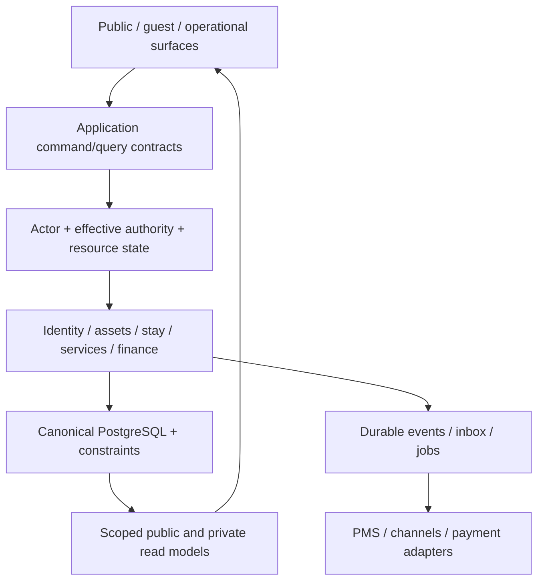

# Архитектурный аудит всей платформы myUNO

Проверка: 2026-10-08, Asia/Bangkok. Исходники main `24138a2d717773534d923244a102631987aad641`, production READY. Под «MyBuna funnel» понимается текущий myUNO discovery → quote → booking/request → trip → services → ownership. Изменения дизайна опубликованы отдельно; этот аудит архитектуры не меняет production-код, данные или финансовые операции.

## Главный вывод

**Основа жизнеспособна, но утверждать “архитектура уже надежна и переносится на любую дестинацию настройками” нельзя.** Правильные опорные решения уже есть: модульный монолит, один PostgreSQL для обычных объектов, единая Identity, физический Unit, канонический Booking/BlockedDate, общий расчет цены, финансовые транзакции, SQL-защита от пересечения бронирований и версионированный inbox внешних событий.

Главная проблема — неодинаковая строгость этих контрактов в разных командах. Бронирование и прием оплаты защищены заметно лучше, чем изменение тарифов, задач, ручные корректировки и расчет выплат. DestinationConfig пока управляет презентацией, а не принадлежностью каталога. Это исправляется последовательными вертикальными изменениями; переписывание в микросервисы сейчас не обосновано измерениями.

## Что проверено и где подробности

Инвентаризация: **160 страниц, 224 API, 227 обработчиков, 22 модуля, 115 Prisma-моделей, 77 миграций, 311 тестовых файлов**. Статический анализ обнаружил 50 междоменных направлений импорта и 37 файлов app с прямыми вызовами Prisma mutations; это сигналы для проверки границ, не 37 доказанных уязвимостей. Взаимные импорты доменов сами по себе не доказывают циклический runtime bug.

| Часть | Подробный отчет | Что внутри |
|---|---|---|
| Дестинации и переносимость | [architecture-destination-audit.md](architecture-destination-audit.md) | 11 findings: membership, routing, currency, timezone, authority, coverage, merchant, localization, внешняя PMS; три сценария расширения и acceptance |
| PMS, инвентарь и деньги | [architecture-operations-audit.md](architecture-operations-audit.md) | 15 findings: готовность check-in, maintenance capacity, concurrency/CAS, recurrence, tariffs, settlements, ledger reversals, refunds, группы и manual commands |
| Безопасность и платформа | [architecture-security-platform-audit.md](architecture-security-platform-audit.md) | 13 findings: authority mismatch, recovery/revocation, rate limits, seed, feed egress, private media, DB role/RLS, миграции и коммуникации |
| Клиентский funnel | [architecture-funnel-audit.md](architecture-funnel-audit.md) | Полный source trace discovery/search/quote/booking/services/login-return/content/locale; query cost, ошибки, связанные контракты |
| Инфраструктура и границы | [architecture-infrastructure-audit.md](architecture-infrastructure-audit.md) | Jobs, automatic retry, partial failures, global leases, timeout budgets, alert delivery, backup/restore и dependency graph |
| Доказательная матрица | [architecture-2026-10-08](audits/architecture-2026-10-08/BASELINE.md) | Baseline, inventory, surface map, все CO01–30/AT01–30 с ограничениями, writers, reconciliation, gaps, release evidence |

Каждое существенное finding содержит фактический участок кода, сценарий, последствия, безопасное исправление и способ проверки. Повторяющиеся findings в нескольких отчетах описывают одну первопричину; их нельзя суммировать в рекламное число дефектов.

## Приоритетные проблемы

| Приоритет | Проблема | Практическое последствие | Ссылка |
|---|---|---|---|
| P0 условный | Default seed создает активного demo administrator с фиксированным опубликованным credential | Запуск default seed в production небезопасен. Наличие такого аккаунта в production **не проверено**, компрометация не заявляется | SEC01 |
| P1 | Generic pricing/block permission не включает организацию и активный unit mandate | MC с ролью на проект потенциально получает команду над чужим управляемым юнитом в том же проекте | SEC02/DEST05 |
| P1 | blocked turnover исключен из check-in blockers; blocksInventory не создает canonical capacity block | Неготовый/ремонтируемый юнит может пройти операционный переход или оставаться продаваемым | O01/O02 |
| P1 | Task/rate/recurrence/group writers используют check-then-write без полного CAS/lock/occurrence identity | Одновременные действия могут перезаписать состояние, создать двойную задачу или конфликтующие тарифы | O03–06/O10 |
| P1 | Reversal/manual cost/manual reservation без надежной command identity и атомарного acknowledgment | Timeout/false500/retry может повторить финансовый факт или оставить успешно созданную бронь без корректного ответа | O08/O11/O13 |
| P1 | Provider remittance использует updatedAt и текущую комиссию; refund теряет созданный ID/повторяет liability effect | Расчет периода и обязательств может измениться от поздней правки, изменения настройки или повторной команды | O07/O14/O15 |
| P1 | Password reset не отзывает старые cookies; одноразовый reset/claim без atomic consumption | Восстановление аккаунта не завершает отзыв сессий; concurrent recovery требует защиты | SEC03/04 |
| P1 | iCal failure может быть job-ok, error account исключается из следующих sync; redirect/DNS guard неполон | “Зеленая” jobhealth может скрыть неработающие каналы, автоматическое восстановление и egress hardening неполны | I01/02/SEC05 |
| P1 расширения | Destination не scope публичных readers; THB/Bangkok assumptions неполностью конфигурируются | Вторая локация может смешать каталог; другая валюта/дата не появляется от замены бренда/символа | DEST01–04 |
| P2 роста | Датированный price sort/filter вычисляет всех кандидатов до пагинации | 100 результатов не означает ограниченную нагрузку; нужна измеренная ограниченная query/projection стратегия | DEST07/funnel |

Это подтвержденные конструкции исходников и проверенные логические сценарии, а не воспроизведенные production incidents. Опасные production вызовы не выполнялись. Уровень P1 не отменяет возможные P0 последствия для денег/инвентаря при фактическом воспроизведении.

## Насколько легко расширяться

| Сценарий | Сейчас | До запуска |
|---|---|---|
| Еще один юнит/condo/курорт на Phuket, тот же THB merchant | Модель пригодна; свой app/DB не требуется | Реальная onboarding/config/media/mandate, scope-тесты, booking/operations/finance acceptance |
| Вторая дестинация Таиланда | Частично; naming/config уже отделены, каталог не разделен | Destination relation/request context, все readers/links/sitemap/cachekeys/coverage, cross-destination fixtures |
| Другая страна/валюта/timezone/merchant | Не configuration-only | Moneycurrency/minorunits, transaction/settlement currency, legal/compliance/merchant packs, locale/time propagation, migration/parity |
| Новый внешний PMS/канал | Контрактная основа есть, Layantara adapter специализирован | Stablemapping, authoritycommands, expectedversion/idempotency, freshness, replay/quarantine/recovery; не клонирование tables |

Для нового рынка нельзя forkнуть Unit/Booking/Identity/ledger или создать synthetic “whole destination property”. Destination — контекст публичного supply и правил; organization/mandate — полномочия; OperatingSpace — портфель работы. Эти три понятия должны оставаться различными.

## Целевая связность

Точки усиления: authority проверяется в command boundary, не только скрытием кнопки; state transition сверяется после lock/CAS; внешний timeout означает pending/unknown; accepted money/terms неизменны; readmodel не дает право подтвердить бронь; async effect имеет identity, retry и измеряемый lag.

## Порядок укрепления без переписывания платформы

1. **Защитить существующие операции.** Проверить seed configuration без default login; unify MC/task effective capability; blocked readiness и maintenance→canonical BlockedDate. Acceptance: negative twoorg fixtures, blocked check-in, concurrent booking vs maintenance, category capacity parity.
2. **Укрепить команды.** Expected-version/CAS для задач/booking/group, unique recurring occurrence, stable requestidentity для брони/расхода/reversal/refund; атомарная command acknowledgment/audit/outbox. Acceptance: barrier-controlled DB races и повтор того же payload после commit/timeout.
3. **Зафиксировать финансовую семантику.** Immutable recognition/businessdate, accepted commission/collector snapshots, refundID returned from own transaction, exactly-once local effects under at-least-once retries, append-only late adjustments. Acceptance: edit после fulfillment, ratechange, late refund, two equal partial refunds, repeated webhook, closed period.
4. **Ввести настоящий DestinationContext.** ADR host/pathpolicy, stablemembership/backfill Phuket, required scoped reader/parser, destination-aware coverage/content/time. Acceptance: две дестинации с одинаковыми category names; links/search/maps/SEO/details не смешивают supply; unknown config не fallback silently.
5. **Проверить рост и восстановление.** Load fixtures 39 / 100 / 1000 units, p95/DBquery count/poolpressure, boundedquotes/maps/history; perresource durable jobs, feed retry/partialhealth; external alert heartbeat и whole-service restore с финансовым reconciliation.
6. **Новая страна отдельным совместимым этапом.** Currency/merchant/jurisdiction contract and expansion migration; shadow parity старого THB, immutable historical facts, reviewed launchcapabilities. Не переносить правила собственности/налогов/платежей одной строкой конфигурации.

Каждый этап: expand → compatible code → controlled backfill → parity → writer / reader cutover → observe → contract. Сначала узкий завершенный process, затем следующий; migrations/datachanges не выполняются из build/install и не маскируются дизайном.

## Что доказано, а что остается неизвестным

Существующие isolated/static/mock suites прошли: destination43,security57,operations19,infrastructure30 tests (есть пересечения, это не суммарная уникальная coverage). Productionbuild и 40 design/navigation/token tests тоже прошли. Это подтверждает полезные текущие защитные механизмы; новые concurrency/authority findings этими тестами не покрыты. Отдельный DB-backed suite отказался инициализироваться без DATABASE_URL_TEST; live DB не использовалась как замена.

Не подтверждены: примененные productionconstraints/grants, отсутствие demoadmin, все role/tenant denial paths, scheduler/backup/alert actual runs, full restore/RPO/RTO, реальная нагрузка и второйdestination. Все CO/AT в [FLOW_MATRIX.md](audits/architecture-2026-10-08/FLOW_MATRIX.md) имеют отдельные девять измерений; ни один полный process не объявлен complete из наличия кода.

**Оценка кода:** подходящая основа, конкретные устранимые дефекты в контрактных границах. **Операционная оценка:** полная готовность PMS/resort и запуск произвольной новой дестинации этим аудитом не установлены. Архитектурные исправления перечислены, но этим read-only проходом не внедрены.
