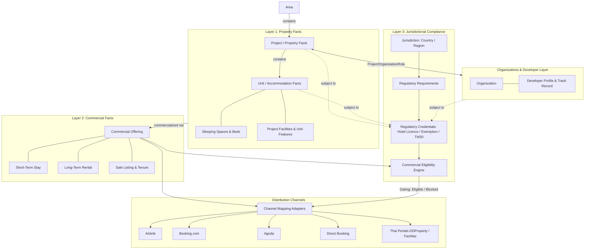

# CANONICAL PROPERTY DATA ARCHITECTURE
**Repository:** `pavel949/myUNO-final`
**Architectural Standard:** One canonical property record + one developer relationship + multiple commercial uses + jurisdiction-aware compliance.

---

## 1. System Overview & Core Directives

The myUNO canonical property architecture unifies hospitality PMS operations, direct booking, OTA distribution (Airbnb, Booking.com, Agoda), real estate portal distribution (DDProperty, FazWaz), short-term stays, long-term rentals, sales, owner asset management, investment analysis, developer project information, and Thailand regulatory compliance.

### The 3 Connected Layers

1. **Layer 1 — Property Facts:** What the physical asset *is* (Project, Developer, Operator, Unit, sleeping layout, areas, features, facilities).
2. **Layer 2 — Commercial / Listing Facts:** How the asset is commercialized (Short-term stay, long-term rental, sale listing, house rules, check-in rules, pricing/terms, channel mappings).
3. **Layer 3 — Jurisdictional Compliance:** What the asset, operator, or commercial activity is legally required or permitted to do (Hotel Business Licence, Exemption, TM30, building permits, safety records).

---

## 2. Comprehensive Architectural Diagram

---

## 3. Data Flow & Inheritance Rules

1. **Developer → Project → Unit Flow:**
   - Projects inherit Developer Organization details (brand, logo, website, track record) via `ProjectOrganizationRole`.
   - Units inherit Project location, timezone, default currency, project-level facilities, and hotel licences.
   - Units specify unit-level physical facts (unit number, category, size, bedrooms, beds, views, private amenities).

2. **Commercial Offering Decoupling:**
   - A single canonical `Unit` can simultaneously or sequentially host a `short_term_stay` offering, a `long_term_rental` offering, or a `sale` offering.
   - Channel Adapters read physical facts + commercial offering terms + compliance gating to generate specific API payloads for Airbnb, Booking.com, Agoda, or property sales portals.

3. **Compliance Gating Engine:**
   - Commercial offerings evaluate backend rules (`canPublishShortTerm`, `canPublishLongTerm`, `canPublishSale`).
   - If a required Hotel Business Licence or valid Exemption credential is missing or expired, short-term commercial eligibility evaluates to `eligible: false` with structured blocking reasons (`REQUIRED_CREDENTIAL_MISSING`).
