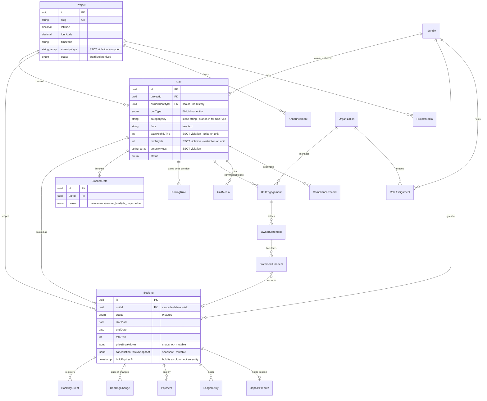
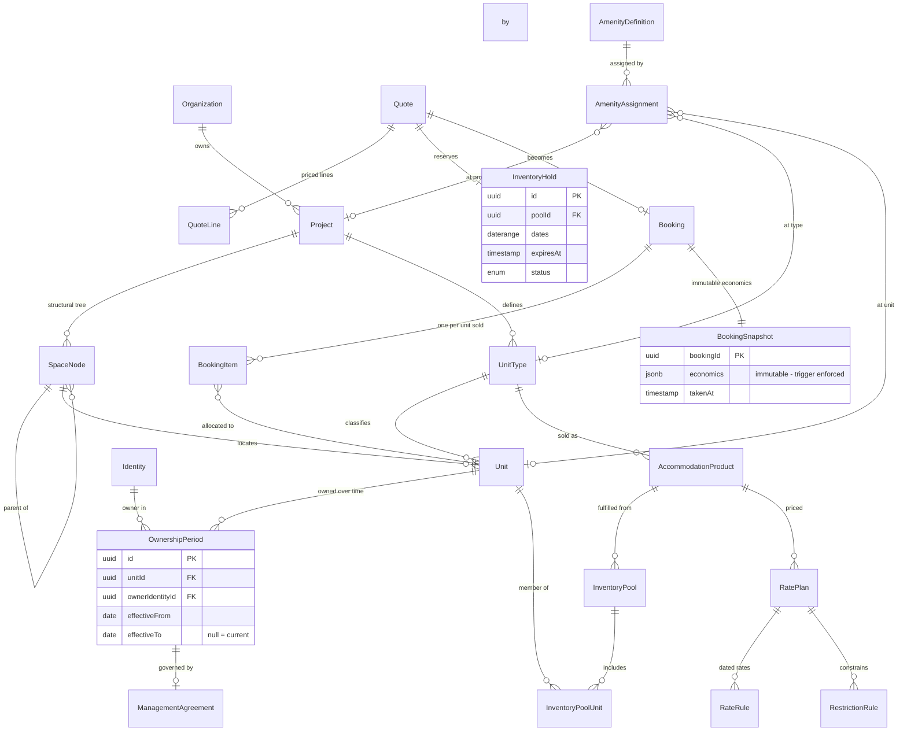

# ERD — Core Domain

Two diagrams: **what exists today** (verified against `prisma/schema.prisma`, 71 models) and
**the target shape** from the master specification. The gap between them is the Phase 1–3 backlog.

---

## 1. As-built (2026-08-18)

**Constraints added this session** (`20260818000014`):

- `booking_dates_ordered` — `CHECK (end_date > start_date)`
- `booking_no_overlap` — `EXCLUDE USING gist (unit_id WITH =, daterange(start_date, end_date,'[)') WITH &&) WHERE status IN ('confirmed','checked_in','pending_payment')`

**Missing relative to the master spec:** `SpaceNode`, `UnitType` (as an entity), `AmenityDefinition`
/ `AmenityAssignment`, `OwnershipPeriod`, `AccommodationProduct`, `InventoryPool`, `AvailabilityDay`,
`InventoryHold` (as an entity), `RatePlan`, `RestrictionRule`, `Quote`, `BookingItem`,
`ChannelMapping`.

---

## 2. Target shape

### Migration path (no destructive step required)

1. `UnitType` entity, backfilled from `Unit.categoryKey`; keep the string column until every read
   moves over.
2. `SpaceNode`, backfilled from `Unit.floor`; `Unit.spaceNodeId` nullable at first.
3. `OwnershipPeriod`, backfilled from `Unit.ownerIdentityId` as one open-ended row per unit. The
   scalar stays as a read-through cache until callers migrate.
4. `AmenityDefinition` / `AmenityAssignment`, backfilled from the two `String[]` columns.
5. `InventoryPool` + `unit_occupancy`, absorbing `Booking` and `BlockedDate` into one exclusion
   constraint — the correct resolution of **P0-4**.
6. `Quote` and `BookingItem` last: they change the checkout contract.

Every step is additive; each old column is dropped only once nothing reads it.
