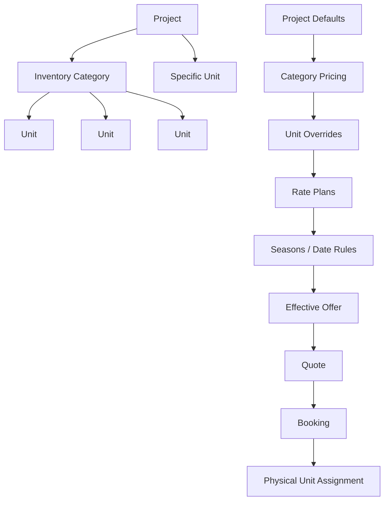

# REVENUE AND TARIFF ENGINE ARCHITECTURE
**Repository:** `pavel949/myUNO-final`
**Architectural Standard:** One flexible revenue & tariff engine for single condos, standalone villas, villa resorts, serviced residences, and hotel room categories.

---

## 1. System Overview

The myUNO Revenue, Tariff, Stay Rules, Tax, and Quotation Engine provides a unified backend calculation service for all commercial accommodation types across the platform.

Key Capabilities:
1. **Physical vs Sellable Inventory Separation:** Physical units represent actual physical assets, whereas sellable inventory represents what the guest actually books (specific unit or inventory category).
2. **Category vs Specific Unit Booking Modes:** Supports category-based booking (hotel rooms / villa categories) where physical units are assigned later, as well as specific unit booking (individual villas / condos).
3. **Hierarchical Tariff Resolution:** Pricing and stay rules inherit from Project → Category → Unit → Rate Plan → Seasons/Overrides with full night-by-night source traceability.
4. **Operations & Maintenance Integration:** Out-of-service or maintenance blocks automatically reduce sellable category capacity.
5. **Configured Thailand Tax Engine:** Applies 7% VAT tax automatically on the taxable accommodation subtotal.

---

## 2. Flexible Inventory & Rate Scope Architecture

---

## 3. Quoting & Quotation Execution Flow

1. Consumer invokes `resolveEffectiveStayOffer(db, query)`.
2. Engine resolves `targetProject`, `targetCategory`, or `targetUnit`.
3. Calculates night-by-night base rate, seasonal overrides, and rate plan transformations.
4. Appends night-by-night **Pricing Source Traceability**.
5. Computes subtotal, 7% VAT tax, and total.
6. Evaluates category capacity (`totalPhysicalUnits - outOfService`) or specific unit availability.
7. Returns authoritative `EffectiveStayOffer` consumed by frontend, checkout, manager workspace, and channel adapters.
