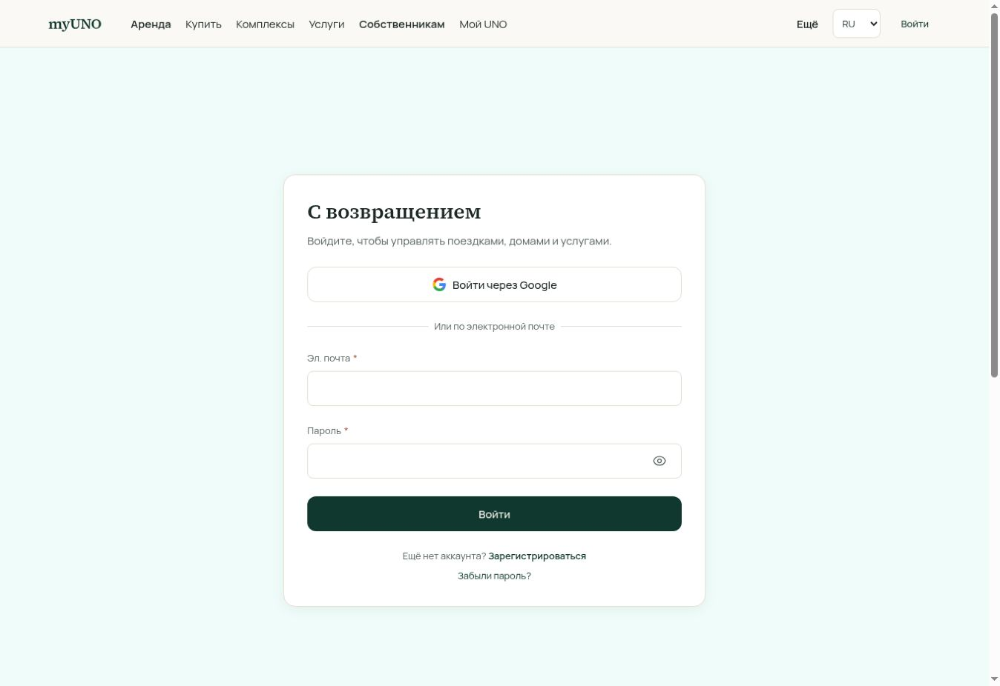

# PMS runtime access audit — 2026-10-08 (Asia/Bangkok)

## Verdict and evidence boundary

The signed-out production browser cannot enter the PMS. Full unit, condominium portfolio or resort operating readiness is **not checked**; inner-screen layout, tariffs and task completion cannot be certified from this run. Authentication correctly gates sampled operations. Two return-navigation defects are directly observed. No credentials, bookings, cash receipts, payment actions, guest records or operational writes were entered.

- Repository snapshot supplied for review: `e92f4a0080ac97698e77ad7b11f70170dfd0455d` on main. This is the source-review baseline, not proof that production ran that exact SHA during capture.
- Environment: canonical production `https://my-uno-final.vercel.app`.
- Capture: dedicated cloud-browser tab 3, Russian locale, desktop viewport 1348×926.
- Authentication state: header shows **Войти**; protected routes finish on the login screen. Google and email/password methods are visible. Browser-auth capability guidance was read. No sign-in request was sent by this child audit to avoid interrupting the parent workflow without coordination.
- Screenshots are exact captured bytes, visually inspected before acceptance and copied into this repository.

## Observed steps

| Step | Requested destination | Final visible state | Health |
|---|---|---|---|
| 1 | `/pms` | Localized 404 | Informational: no canonical `/pms` entry; use actual workspace routes |
| 2 | `/ops` | `/login?next=/ops` | Protected; inner Today board not checked |
| 3 | `/app/admin/units` | `/login?next=/app/admin` | **Failed return intent**: unit-list destination lost |
| 4 | `/mc/portfolio` | `/login?next=/mc/portfolio` | Protected; portfolio not checked |
| 5 | `/ops/calendar/board` | `/login?next=/ops/calendar/board` | Protected; calendar/pricing not checked |
| 6 | `/ops/units/layantara-unit-fe4afe85-6fcc-46dd-810e-62e11fc09301/edit` | `/login?next=/ops/units` | **Failed return intent**: exact unit lost; return path has no page in route inventory |

The pages briefly render a workspace shell before redirecting. The accepted screenshots show the settled login state, not that transient shell.

### Step 2 — operations login

The login form is centered, labels and submit control are visible, and no overlap appears at the captured desktop size. This says nothing about internal PMS responsive layouts. Consumer-oriented copy does not identify the required staff/manager scope; a contextual explanation could reduce operator confusion.

### Steps 3, 5 and 6 — return navigation

The rendered form is visually the same login screen. The recorded URL distinguishes the lost destination:

- [Step 3 screenshot](evidence/pms-2026-10-08/pms-02-admin-deep-link-login.jpg)
- [Step 5 screenshot](evidence/pms-2026-10-08/pms-03-calendar-login.jpg)
- [Step 6 screenshot](evidence/pms-2026-10-08/pms-04-unit-editor-login.jpg)

## Proven findings and source-linked recommendations

| ID | Severity | Evidence | Effect | Recommendation |
|---|---|---|---|---|
| PMS-R01 | P1 | Step 6 plus `src/app/ops/units/[unitId]/edit/page.tsx`: hardcoded `next=/ops/units`; no `src/app/ops/units/page.tsx` | A manager opening a villa editor while signed out loses the villa and may return to a missing page after login | Preserve exact safe editor path and supported query context in login return |
| PMS-R02 | P2 | Step 3 plus `src/app/(admin)/app/admin/layout.tsx`: hardcoded `next=/app/admin` | Deep administrative links return to dashboard instead of the intended unit/project screen | Retain the validated local pathname and supported context at shared auth boundary |
| PMS-R03 | P2, recommendation | Step 2 login screenshot | Operators see generic trip/home/services copy with no role or property context | Add contextual workspace sign-in description; never imply registration grants operational authority |
| PMS-R04 | P2, source review only | `/ops/spaces/[spaceId]` links both Pricing and Calendar to `/ops/calendar/board?spaceId=...` | Named pricing destination may not reveal a distinct tariff editing task | Verify authorized revenue role journey; use explicit pricing entry or selected tab while retaining scope |
| PMS-R05 | P2, source review only | Project inventory links each unit but contains no direct category-tariff link; tariff editor is embedded in admin unit detail | Resort managers may need to open an arbitrary villa to edit category pricing | Provide category rate action, category identity and affected-unit preview at category level; validate actual runtime before redesign |

R04/R05 are source-led UX hypotheses, not screenshot-proven failures. Another workstream reviews writers and permissions. Tariff correctness and whether category bulk save affects canonical units require that evidence.

## Required role and scope before a full click-through

- Admin control plane: `user.isAdmin` in shared AdminLayout.
- Operations Today: admin or active staff project scope, with department-specific navigation derived in OpsLayout.
- Manager portfolio: management-company project scopes, staff scope or admin; MC portfolio currently redirects to the appropriate scoped MC or calendar view.
- Operating Space: active membership and explicit capabilities, or admin. Calendar enforces operating-space membership and exact authorized managed-unit scopes.
- Managed-unit editor: admin, relevant `staff_ops` scope, management-company authorization or eligible self-listing ownership. Detailed behavior remains unverified.

Authentication is not bypassed; an authorized session with both the condominium portfolio and Layantara operational scope is required to complete the requested UI audit.

## Static route checklist — not runtime verification

The following 61 PMS-related page patterns exist in this source snapshot. Group layouts, APIs, finance reconciliation outside `/app/admin`, and owner workspace routes are reviewed separately by the wider audit. **Every inner screen below remains runtime not checked unless listed in the observed table**, where only its signed-out access boundary was checked.

| Route pattern | Source | Runtime status |
|---|---|---|
| `/app/admin/bookings` | `src/app/(admin)/app/admin/bookings/page.tsx` | Not checked after authentication |
| `/app/admin/bookings/[id]/journey` | `src/app/(admin)/app/admin/bookings/[id]/journey/page.tsx` | Not checked after authentication |
| `/app/admin/compliance` | `src/app/(admin)/app/admin/compliance/page.tsx` | Not checked after authentication |
| `/app/admin/compliance-checklists` | `src/app/(admin)/app/admin/compliance-checklists/page.tsx` | Not checked after authentication |
| `/app/admin/config` | `src/app/(admin)/app/admin/config/page.tsx` | Not checked after authentication |
| `/app/admin/contracts` | `src/app/(admin)/app/admin/contracts/page.tsx` | Not checked after authentication |
| `/app/admin/layantara` | `src/app/(admin)/app/admin/layantara/page.tsx` | Not checked after authentication |
| `/app/admin/ledger` | `src/app/(admin)/app/admin/ledger/page.tsx` | Not checked after authentication |
| `/app/admin/operational-kpis` | `src/app/(admin)/app/admin/operational-kpis/page.tsx` | Not checked after authentication |
| `/app/admin/organizations` | `src/app/(admin)/app/admin/organizations/page.tsx` | Not checked after authentication |
| `/app/admin/payouts` | `src/app/(admin)/app/admin/payouts/page.tsx` | Not checked after authentication |
| `/app/admin/people` | `src/app/(admin)/app/admin/people/page.tsx` | Not checked after authentication |
| `/app/admin/projects` | `src/app/(admin)/app/admin/projects/page.tsx` | Not checked after authentication |
| `/app/admin/projects/[id]` | `src/app/(admin)/app/admin/projects/[id]/page.tsx` | Not checked after authentication |
| `/app/admin/projects/[id]/amenities/[amenityId]/reservations` | `src/app/(admin)/app/admin/projects/[id]/amenities/[amenityId]/reservations/page.tsx` | Not checked after authentication |
| `/app/admin/projects/[id]/experience` | `src/app/(admin)/app/admin/projects/[id]/experience/page.tsx` | Not checked after authentication |
| `/app/admin/projects/[id]/inventory` | `src/app/(admin)/app/admin/projects/[id]/inventory/page.tsx` | Not checked after authentication |
| `/app/admin/projects/[id]/media` | `src/app/(admin)/app/admin/projects/[id]/media/page.tsx` | Not checked after authentication |
| `/app/admin/projects/[id]/preview` | `src/app/(admin)/app/admin/projects/[id]/preview/page.tsx` | Not checked after authentication |
| `/app/admin/projects/[id]/services` | `src/app/(admin)/app/admin/projects/[id]/services/page.tsx` | Not checked after authentication |
| `/app/admin/projects/[id]/structure` | `src/app/(admin)/app/admin/projects/[id]/structure/page.tsx` | Not checked after authentication |
| `/app/admin/properties/[id]/onboarding` | `src/app/(admin)/app/admin/properties/[id]/onboarding/page.tsx` | Not checked after authentication |
| `/app/admin/properties/new` | `src/app/(admin)/app/admin/properties/new/page.tsx` | Not checked after authentication |
| `/app/admin/statements` | `src/app/(admin)/app/admin/statements/page.tsx` | Not checked after authentication |
| `/app/admin/units` | `src/app/(admin)/app/admin/units/page.tsx` | Not checked after authentication |
| `/app/admin/units/[id]` | `src/app/(admin)/app/admin/units/[id]/page.tsx` | Not checked after authentication |
| `/app/admin/units/[id]/structure` | `src/app/(admin)/app/admin/units/[id]/structure/page.tsx` | Not checked after authentication |
| `/mc` | `src/app/mc/page.tsx` | Not checked after authentication |
| `/mc/calendar` | `src/app/mc/calendar/page.tsx` | Not checked after authentication |
| `/mc/costs` | `src/app/mc/costs/page.tsx` | Not checked after authentication |
| `/mc/mobilization` | `src/app/mc/mobilization/page.tsx` | Not checked after authentication |
| `/mc/mobilization/[unitId]` | `src/app/mc/mobilization/[unitId]/page.tsx` | Not checked after authentication |
| `/mc/portfolio` | `src/app/mc/portfolio/page.tsx` | Not checked after authentication |
| `/mc/properties/[unitId]` | `src/app/mc/properties/[unitId]/page.tsx` | Not checked after authentication |
| `/mc/requests` | `src/app/mc/requests/page.tsx` | Not checked after authentication |
| `/mc/tm30` | `src/app/mc/tm30/page.tsx` | Not checked after authentication |
| `/mc/units/[unitId]` | `src/app/mc/units/[unitId]/page.tsx` | Not checked after authentication |
| `/ops` | `src/app/ops/page.tsx` | Not checked after authentication |
| `/ops/calendar` | `src/app/ops/calendar/page.tsx` | Not checked after authentication |
| `/ops/calendar/[unitId]` | `src/app/ops/calendar/[unitId]/page.tsx` | Not checked after authentication |
| `/ops/calendar/board` | `src/app/ops/calendar/board/page.tsx` | Not checked after authentication |
| `/ops/claims` | `src/app/ops/claims/page.tsx` | Not checked after authentication |
| `/ops/costs` | `src/app/ops/costs/page.tsx` | Not checked after authentication |
| `/ops/housekeeping` | `src/app/ops/housekeeping/page.tsx` | Not checked after authentication |
| `/ops/maintenance` | `src/app/ops/maintenance/page.tsx` | Not checked after authentication |
| `/ops/mobilization` | `src/app/ops/mobilization/page.tsx` | Not checked after authentication |
| `/ops/mobilization/[unitId]` | `src/app/ops/mobilization/[unitId]/page.tsx` | Not checked after authentication |
| `/ops/new-unit` | `src/app/ops/new-unit/page.tsx` | Not checked after authentication |
| `/ops/night-audit` | `src/app/ops/night-audit/page.tsx` | Not checked after authentication |
| `/ops/projects/[id]/edit` | `src/app/ops/projects/[id]/edit/page.tsx` | Not checked after authentication |
| `/ops/requests` | `src/app/ops/requests/page.tsx` | Not checked after authentication |
| `/ops/reservations` | `src/app/ops/reservations/page.tsx` | Not checked after authentication |
| `/ops/spaces` | `src/app/ops/spaces/page.tsx` | Not checked after authentication |
| `/ops/spaces/[spaceId]` | `src/app/ops/spaces/[spaceId]/page.tsx` | Not checked after authentication |
| `/ops/stays` | `src/app/ops/stays/page.tsx` | Not checked after authentication |
| `/ops/stays/[bookingId]` | `src/app/ops/stays/[bookingId]/page.tsx` | Not checked after authentication |
| `/ops/stays/[bookingId]/check-in` | `src/app/ops/stays/[bookingId]/check-in/page.tsx` | Not checked after authentication |
| `/ops/tasks` | `src/app/ops/tasks/page.tsx` | Not checked after authentication |
| `/ops/team` | `src/app/ops/team/page.tsx` | Not checked after authentication |
| `/ops/tm30` | `src/app/ops/tm30/page.tsx` | Not checked after authentication |
| `/ops/units/[unitId]/edit` | `src/app/ops/units/[unitId]/edit/page.tsx` | Not checked after authentication |

## Remaining acceptance run

1. Enter each workspace using an authorized account; verify correct unit/project/organization context after sign-in, refresh and back navigation.
2. Individual unit: facts/media, access, availability blocks, rates, readiness, bookings, condition, maintenance and owner/accounting links.
3. Condominium portfolio: exact managed-unit boundary, building/category filters, scoped calendar, grouped tasks, costs and summary counts.
4. Layantara resort: all 39 physical villas and 8 real categories, room-type/alternative bedroom capacity, seasonal tariffs, category bulk edit preview, booking import/integration status and project-wide reporting.
5. Staff tasks: requests, reservations, arrivals, check-in, in-house, checkout, housekeeping, maintenance, TM30, reconciliation and team permissions. Avoid financial or guest-state writes without a disposable test context.
6. Responsive and accessibility: smaller viewport, keyboard/focus, long Thai/Russian labels, menu overflow, sticky header/calendar alignment, form recovery and error/empty/loading states.

No claim of full PMS usability or production readiness is made. Code presence is separately reviewable; operating readiness requires the authenticated UI and domain checks above.
